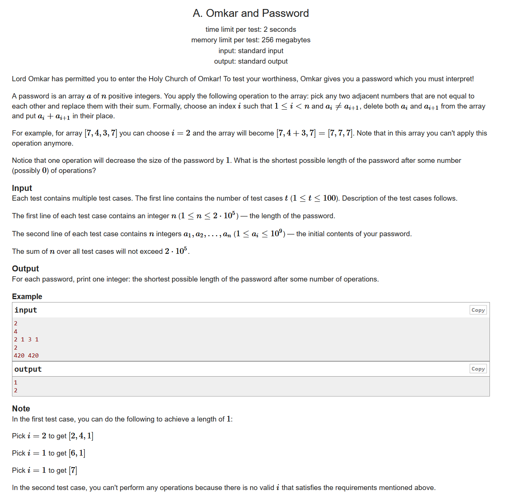
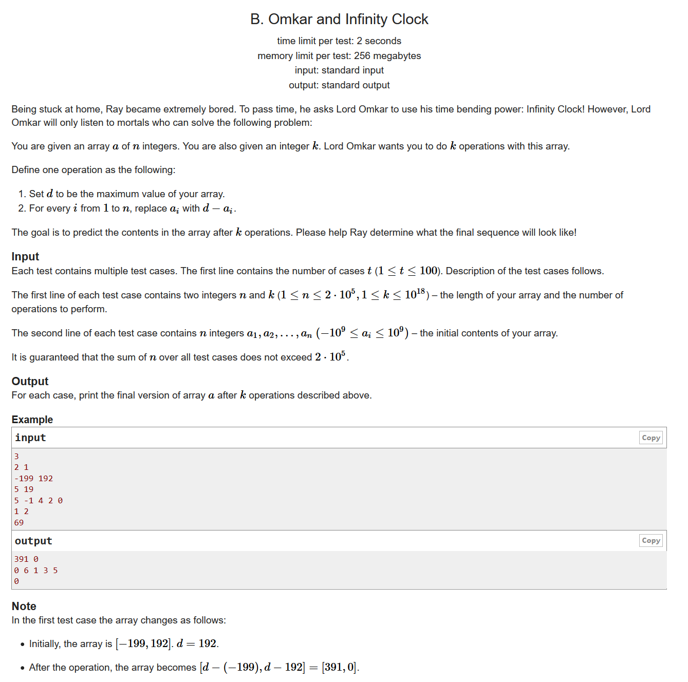
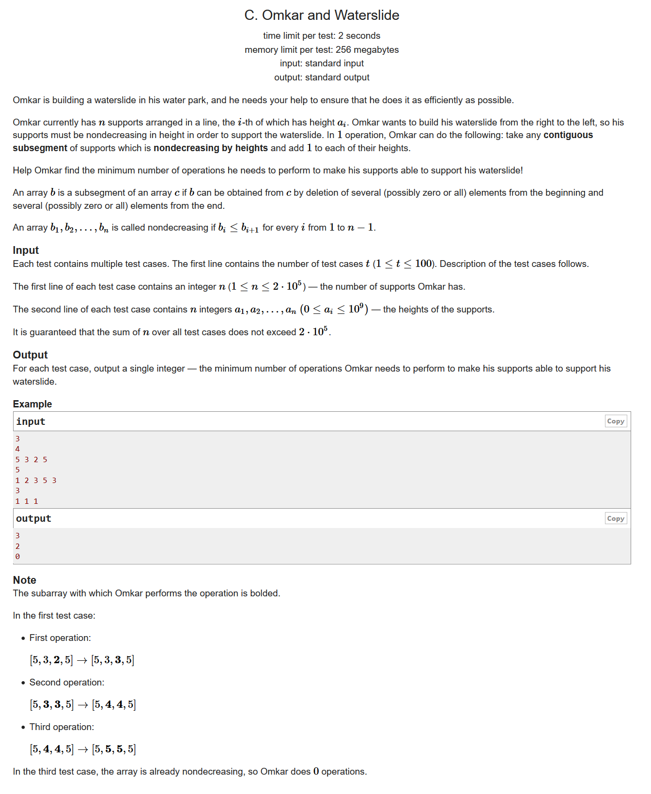
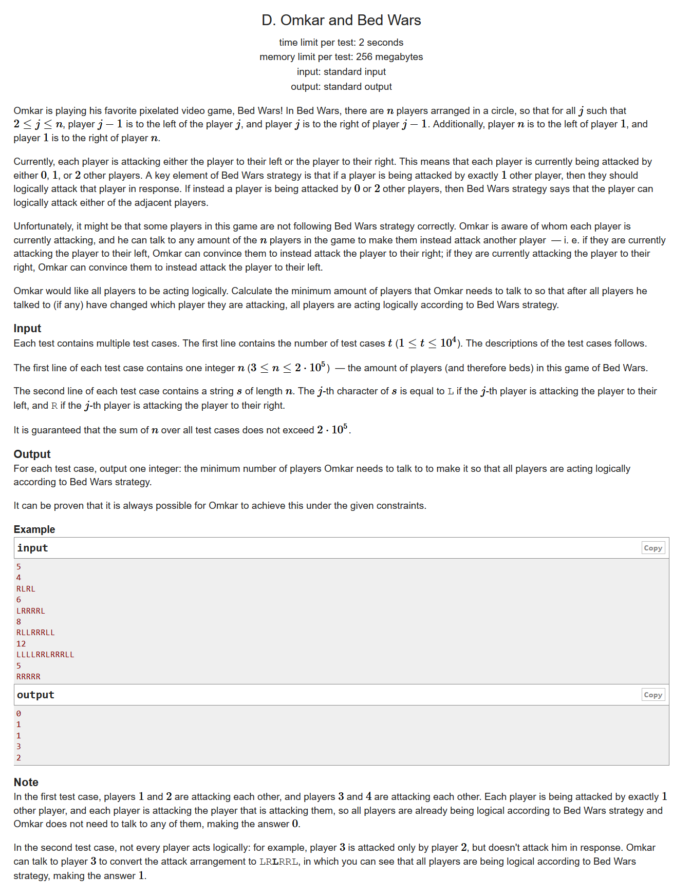
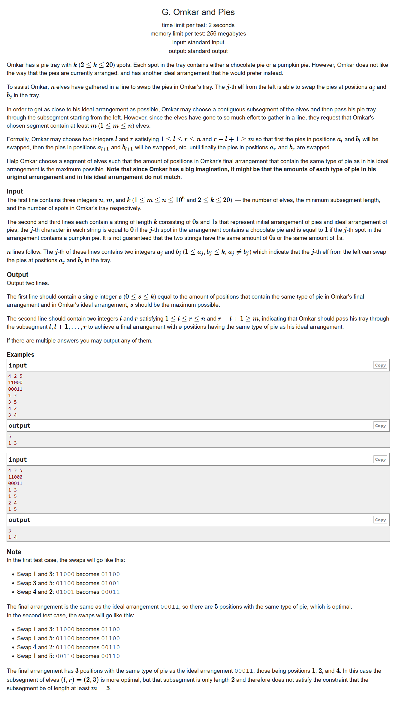

# Codeforces Global Round 10

https://codeforces.ml/contest/1392/problems

## A. Omkar and Password



- 结论题
- 如果数字全都一样，那么就不能够缩减；如果数字不一样，那就一定可以缩减成1

```cpp
#include <bits/stdc++.h>
using namespace std;
#define LL long long
#define sigma_size 30
#define max_size (int)(2e5+10)
#define MAX (int)(1e5+7)

int ans[105];
int a[max_size];
int main ()
{
	ios::sync_with_stdio(0);
	int T ; cin >> T ;
	for ( int cas = 1 ; cas <= T ; cas++ )
	{
		int n ; cin >> n;
		for ( int i = 1 ; i <= n ; i++ ) cin >> a[i];

		bool flag = true;
		for ( int i = 1 ; i < n ; i++ )
			if ( a[i] != a[i+1] )
			{
				flag = false;
				break;
			}
		if ( flag ) ans[cas] = n;
		else ans[cas] = 1;
	}
	for ( int i = 1 ; i <= T ; i++ )
		cout << ans[i ] << endl;
}
```

## B. Omkar and Infinity Clock



- 模拟
- 先按照题目的意思重新构造一次整个数列，用一个数组保存；然后再重新构造一次数列，用另外一个数组保存
- 根据k的奇偶性可以很容易判断最后是哪一个数组

```cpp
#include <bits/stdc++.h>
using namespace std;
#define LL long long
#define sigma_size 30
#define max_size (int)(2e5+10)
#define MAX (int)(1e5+7)

LL a[max_size];
LL b[max_size];
int main ()
{
	ios::sync_with_stdio(0);
	int T ; cin >> T;
	while (T--)
	{
		LL n , k;
		cin >> n >> k;
		for ( int i = 1 ; i <= n ; i++ ) cin >> a[i];

		LL maxx = - (1ll << 60);
		for ( int i = 1 ; i <= n ; i++ )
			maxx = max ( maxx , a[i] );
		for ( int i = 1 ; i <= n ; i++ )
			a[i] = maxx - a[i];
		maxx = - (1ll << 60);
		for ( int i = 1 ; i <= n ; i++ )
			maxx = max ( maxx , a[i] );
		for ( int i = 1 ; i <= n ; i++ )
			b[i] = maxx - a[i];
		if ( n == 1 )
			cout << "0" << endl;
		else if ( k & 1 )
		{
			for ( int i = 1 ; i <= n ; i++ )
				cout << a[i] << " ";
			cout << endl;
		}
		else 
		{
			for ( int i = 1 ; i <= n ; i++ )
				cout << b[i] << " ";
			cout << endl;
		}
	}
}
```

## C. Omkar and Waterslide



- 思维，结论
- 遍历整个数组，如果当前的数大于等于上一个数，即a[i]>=a[i-1]，我们就不用操作。

	因为这个a[i]一定可以跟着上一个数一起上升，当不能再上升的时候，答案依然是上一个数的结果

- 如果a[i]< a[i-1],我们的ans就增加他们的差值，可以理解为a[i]需要先上升到和a[i-1]同样的高度之后跟着a[i-1]一起上升
  
```cpp
#include <bits/stdc++.h>
using namespace std;
#define LL long long
#define sigma_size 30
#define max_size (int)(2e5+10)
#define MAX (int)(1e5+7)


LL ans[105];
LL a[max_size];

int main ()
{
	ios::sync_with_stdio(0);
	int T ; cin >> T;
	for ( int cas = 1 ; cas <= T ; cas++ )
	{
		int n ; cin >> n;
		for ( int i =1 ; i <= n ; i++ ) cin >> a[i];
		LL res = 0;
		for ( int i = 2 ; i <= n ; i++ )
		{
			if ( a[i] >= a[i-1] ) continue;
			res += a[i-1] - a[i];
		}
		ans[cas] = res;
	}
	for ( int i = 1 ; i <= T ; i++ )
		cout << ans[i] << endl;
}
```

## D. Omkar and Bed Wars



- 结论
- 如果整个序列全都是一样的，例如:"RRRRRRR...",那么答案就是1+(n-1)/3
- 如果整个序列不一样，那我们可以看做是几个分段的序列，例如："LLRRRLLRRRR"我们可以把连续相同的几个序列拿出来并且构建出他们的数组"2 3 2 4"，我们很容易知道不能有3个相同的字母连在一起，也就是说我们每3个字母在一块的时候就一定要有一个变个方向，那么答案就是每段序列/3加起来
- 值得注意的是，首尾有可能是相等的，相等的时候我们不妨把最后一个加到第一个，最后一个变成0

```cpp
#include <bits/stdc++.h>
using namespace std;
#define LL long long
#define sigma_size 30
#define max_size (int)(2e5+10)
#define MAX (int)(1e5+7)

int ans[10005];

int main ()
{
	ios::sync_with_stdio(0);
	int T ; cin >> T;
	for ( int cas = 1 ; cas <= T ; cas++ )
	{
		int n ; cin >> n;
		string s; cin >> s;
		s = ' ' + s;
		vector <int> v;
		for ( int i = 1 ; i <= n ; i++ )
		{
			int j = i;
			int cnt = 0;
			while ( s[j] == s[i] )
			{
				j++;
				cnt++;
			}
			i = j-1;
			v.push_back(cnt);
		}
		if ( s[1] == s[n] && v.size() > 1 )
		{
			v.back() += v.front();
			v.front() = 0;
		}
		int res = 0;
		if ( v.size() == 1 )
			res = 1 + ( v[0] - 1 ) / 3;
		else
			for ( int i = 0 ; i < v.size() ; i++ )
				res += v[i] / 3;
		ans[cas] = res;
	}
	for ( int i = 1 ; i <= T ; i++ )
		cout << ans[i] << endl;
}
```

## E. Omkar and Duck


- 交互题
- 我们主要是可以把它的路线全都枚举出来，用一个二进制位数表示，然后我们根据这个二进制位数去构造不同的和

```cpp
#include <bits/stdc++.h>
using namespace std;
#define LL long long
#define sigma_size 30
#define max_size (int)(1e6+10)
#define MAX (int)(1e5+7)

int main ()
{
    ios::sync_with_stdio(0);
    int n;
    cin >> n;
    LL ans[26][26];
    memset ( ans , 0  ,sizeof(ans) );
    for ( int i = 0  ; i < n ; i++ )
    {
        for ( int j = 0 ; j < n ; j++ )
        {
            if ((i-j+n)&2ll) ans[i][j] = (1ll<<(i+j));
            cout << ans[i][j] << " \n"[j==n-1];
        }
    }
    cout << flush;
    int q ; cin >> q;
    for ( int i = 1 ; i <= q ; i++ )
    {
        LL sum ; cin >> sum;
        cout << "1 1" ;
        int row = 0 , col = 0;
        for ( int diag = 0 ; diag < 2*n-2 ; diag++ )
        {
            LL sh = sum&(1ll<<(diag+1));
            if ( row + 1 < n && ans[row+1][col] == sh ) row++;
            else col++;
            cout << " " << row+1 << " " << col+1 ;
        }
        cout << endl << flush;
    }
}
```

## F. Omkar and Landslide


- 结论题，模拟
- 因为输入的时候是严格递增的，我们假设$h[l,r]$差值都是1，并且$h[r] + 2 == h[r+1]$，通过模拟我们可以发现，最后的结果就是$h[l]++,h[r+1]--$，并且贡献了一对相同的高度$h[l] == h[l+1]$
- 如果原本就有一对相同的高度$h[l]==h[l+1]$,并且$h[r+1] - h[r] == 2$，那就相当于上面的一步操作是从$h[l+1]$开始的，这样一来，我们不仅会拆散原来的那一对相同的高度，还会重新组建一对相同的高度$h[l+1]==h[l+2]$
- 综上所述，如果所有元素没有相同的高度，那么一次执行之后可能会产生一对

	如果一开始就有一对相同的高度，那么一次执行之后也可能会拆散一对

	但是这都不重要，因为由此我们可以推出最后的序列应该是差值为1的等差数列，最多有一对数字高度相同。

- 那我们就可以从$h[1]$开始构造等差数列，不妨一开始的时候使得所有的元素全都-h[1]-i+1也就是把他们太高的那一部分削掉并且累加起来，最后把我们累加的数$sum/n$分配到每个数当中去，如果分配后还有剩余，我们就从h[1]开始一个一个+1就可以了

```cpp
#include <bits/stdc++.h>
using namespace std;
#define LL long long
#define ULL unsigned long long
#define sigma_size 30
#define max_size (int)(1e6+10)
#define MAX_SIZE (int)(4e6+7)

LL n ;
LL h[max_size] , res[max_size];
LL sum = 0;
int main ()
{
	ios::sync_with_stdio(0);
	cin >> n;
	for ( int i = 1 ; i <= n ; i++ )
	{
		cin >> h[i];
		sum += h[i] - h[1] - i + 1;
	}
	for ( int i = 1 ; i <= n ; i++ )
		res[i] = h[1] + i - 1 + sum/n;
	for ( int i = 1 ; i <= sum%n ; i++ )
		res[i]++;
	for ( int i =1 ; i <= n ; i++ )
		cout << res[i] << " ";
	cout << endl;
}
```

## G. Omkar and Pies



- 状态压缩dp
- 题目大意：你现在有两个字符串s,t

	你还有n个小精灵，某个小精灵i可以变更s的两个坐标$a[i],b[i]$,使得这两个数交换位置

	你现在需要选定一个长度不小于m的区间[l,r]，使得操作完$(a[l],b[l])(a[l+1],b[l+1])...(a[r],b[r])$ 之后两个串的相似度最大

- 由k的范围可知我们可以把字符串变成一种状态state
- 由于我们交换的时候状态很难从$l$转移到$l+1$，那么其实我们可以考虑再s执行完l操作之后，我们让t也执行以下l操作，这样我们就可以顺利的完成状态转移了
- 我们用$dp[0][state]$表示s串state状态的时候需要用到的最靠左的l

	用$dp[1][state]$表示t串state状态的时候需要用到的最靠右的l

	如果$dp[1][state]-dp[0][state]>=m$那么$(dp[0][state]+1,dp[1][state])$就是我们要的区间

- 但是我们有可能并不能让这两个串完全相同，这个时候我们就得考虑一下相似度的问题了，设$o1$为s串中1的数目$o2$为t串中1的数目，$same$为两个串共同的1的数目，x为不同元素的数目，y为相似度，我们有：

$$ o1+o2-2*same = x = k-y $$

- 要使得y最大，我们就是要让same最大，在本题中我们用state来表示**共同的1**的状态。于此同时，我们枚举state的子集，更新他们的状态。因此我们在枚举state的状态的时候是倒序枚举的


```cpp
#include <bits/stdc++.h>
using namespace std;
#define LL long long
#define sigma_size 30
#define max_size (int)(1e6+10)
#define _DEBUG1 freopen("input.txt", "r", stdin);freopen("output.txt", "w", stdout);
#define _DEBUG2 fclose("input.txt");fclose("output.txt");


int n , m , k;
int o1 , o2;
int x , y;
string s , t;
int p[max_size];
int dp[2][1<<21];

void f ( int& x , int& y )
{
	x = y = 0;
	for ( int i = 0 ; i < k ; i++ )
	{
		if ( s[i] == '1' ) x |= ( 1 << p[i] );
		if ( t[i] == '1' ) y |= ( 1 << p[i] );
	}
}
int main ()
{
	ios::sync_with_stdio(0);
	cin >> n >> m >> k;
	cin >> s >> t;
	for ( int i = 0 ; i < k ; i++ )
	{
		p[i] = i;
		o1 += ( s[i] == '1' );
		o2 += ( t[i] == '1' );
	}
	memset ( dp[0] , 0x3f3f3f3f , sizeof(dp[0]) );
	memset ( dp[1] , 0 , sizeof(dp[1]) );
	f(x,y) ; dp[0][x] = 0 , dp[1][y] = 0;
	for ( int i = 1 ; i <= n ; i++ )
	{
		int a , b ; cin >> a >> b;
		a-- , b--;
		swap ( p[a] , p[b] );
		f(x,y);
		dp[0][x] = min ( dp[0][x] , i );
		dp[1][y] = max ( dp[1][y] , i );
	}

	int ans = 0;
	int ansl = 1 , ansr = 1;
	for ( int i = (1<<k)-1 ; i >= 0 ; i-- )
	{
		int tmp = k - (o1 + o2 - 2*__builtin_popcount(i));
		if ( tmp > ans && dp[1][i] - dp[0][i] >= m )
		{
			ans = tmp;
			ansl = dp[0][i] + 1;
			ansr = dp[1][i];
		}
		for ( int j = 0 ; j < k ; j++ )
		{
			if ( i >> j & 1 )
			{
				dp[0][i^(1<<j)] = min ( dp[0][i] , dp[0][i^(1<<j)]);
				dp[1][i^(1<<j)] = max ( dp[1][i] , dp[1][i^(1<<j)]);
			}
		}
	}
	cout << ans << endl;
	cout << ansl << " " << ansr << endl;
}
```