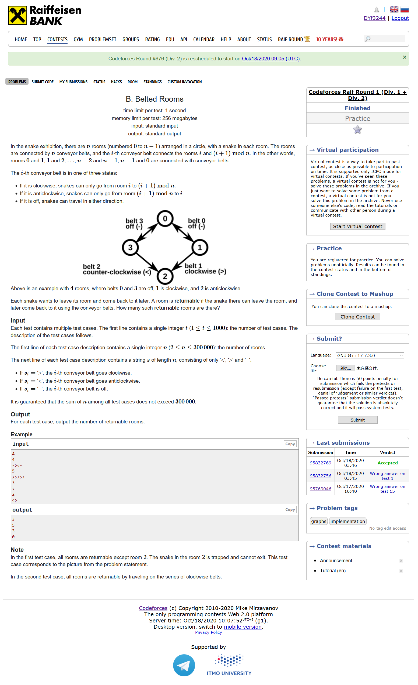
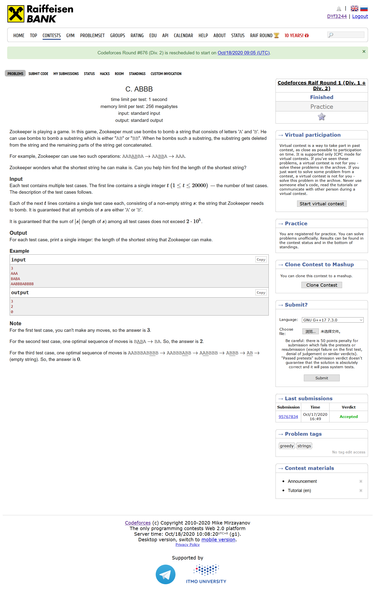
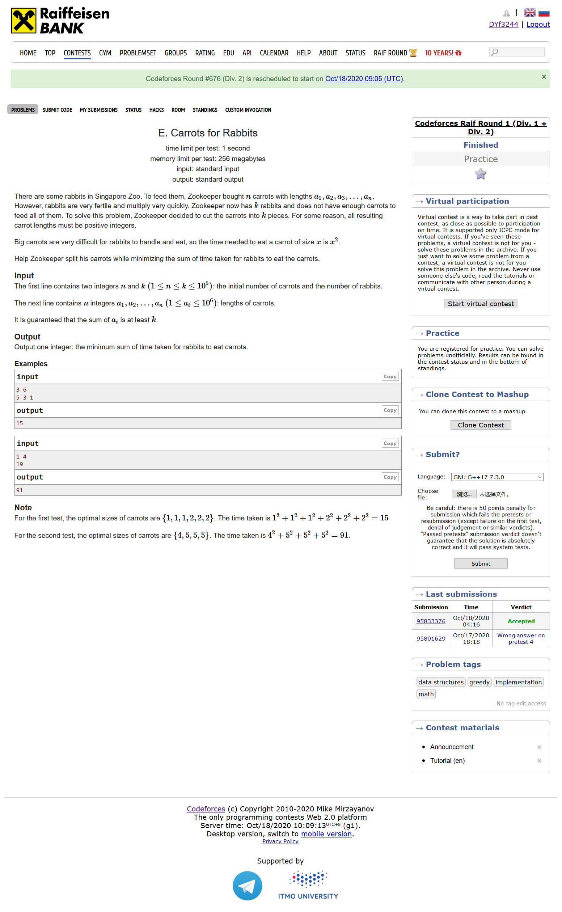
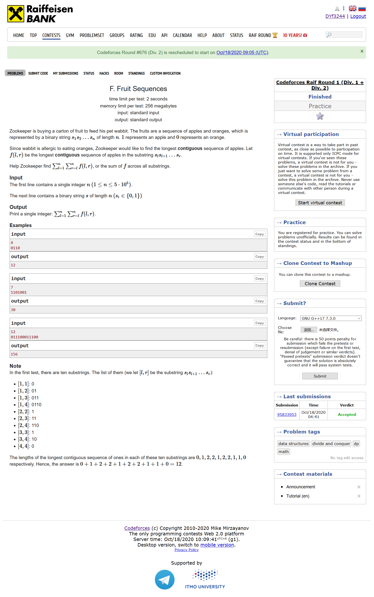

# Codeforces Raif Round 1 (Div. 1 + Div. 2)

- [官方题解](https://codeforces.ml/blog/entry/83771)

## [A. Box is Pull](https://codeforces.ml/contest/1428/problem/A)


- 模拟
- 如果箱子和目标位置在同一个x轴或者同一个y轴上，那时间便是直接拉过去所需的时间即可
- 如果有转弯的情况，那么时间还需要+2

```cpp
#include <bits/stdc++.h>
using namespace std;
#define LL long long
#define sigma_size 30
#define max_size (int)(1e6+10)
#define MAX (int)(1e5+7)


int ans[1005];
int main ()
{
	ios::sync_with_stdio(0);
	int T ; cin >> T;
	for ( int cas = 1 ; cas <= T ; cas++ )
	{
		LL x1 , y1 , x2 , y2;
		cin >> x1 >> y1 >> x2 >> y2;
		LL res = abs(x1-x2);
		res += abs(y1-y2);
		if ( abs(x1-x2) != 0 && abs(y1-y2) != 0 )
			res += 2;
		ans[cas] = res;
	}
	for ( int i = 1 ; i <= T ; i++ )
		cout << ans[i] << endl;
}
```

## [B. Belted Rooms](https://codeforces.ml/contest/1428/problem/B)



- 模拟
- 一个房间能不能回到原点，有两种情况，要么就是前后有一个双向通道，使得这个房间可以一步之内回到原点，要么就是这个房间可以绕一圈回到原点
- 如此一来，我们对于那些需要绕一圈才能回到原点的，只需要看看中间每一个是不是都可以走

```cpp
#include <bits/stdc++.h>
using namespace std;
#define LL long long
#define sigma_size 30
#define max_size (int)(3e5+10)
#define MAX (int)(1e5+7)

int ans[1005];
int n;
string s;
int mark[max_size];
bool all_clockwise() {
	for ( int i = 0 ; i < n ; i++ )
		if ( s[i] == '<' )
			return false;
	return true;
}
bool add_coclockwise() {
	for ( int i = 0 ; i < n ; i++ )
		if ( s[i] == '>' )
			return false;
	return true;
}

int main ()
{
	ios::sync_with_stdio(0);
	int T ; cin >> T;
	for ( int cas = 1 ; cas <= T ; cas++ )
	{
		cin >> n;
		cin >> s;
		int res = 0;
		bool flag = true;
		if ( add_coclockwise() || all_clockwise() )
			ans[cas] = n;
		else
		{
			int res = 0;
			for ( int i = 0 ; i < n ; i++ )
				if ( s[(i+n-1)%n] == '-' || s[i] == '-' )
					res++;
			ans[cas] = res;
		}
	}
	for ( int i = 1 ; i <= T ; i++ )
		cout << ans[i] << endl;
}
```

## [C. ABBB](https://codeforces.ml/contest/1428/problem/C)



- 模拟
- 我们先把位于中间位置的A消灭掉，最后消灭B

```cpp
#include <bits/stdc++.h>
using namespace std;
#define LL long long
#define sigma_size 30
#define max_size (int)(2e5+10)
#define MAX (int)(1e5+7)

int ans[max_size];
string s;
int main ()
{
    ios::sync_with_stdio(0);
    int T ; cin >> T;
    for ( int cas = 1 ;cas <= T ; cas++ )
    {
        cin >> s;
        int n = s.length();
        vector <char> v;
        for ( int i = 0 ; i < n ; i++ )
        {
            if ( v.empty() ) v.push_back(s[i]);
            else if ( v.back() == 'B' )
                v.push_back(s[i]);
            else if ( v.back() == 'A' )
            {
                if ( s[i] == 'A' )
                    v.push_back(s[i]);
                else if ( s[i] == 'B' )
                    v.pop_back();
            }
        }
        int cnt1 = 0 ;
        int cnt2 = 0 ;
        for ( int i = 0 ; i < v.size() ; i++ )
        {    
            if ( v[i] == 'B' ) cnt1++;
            if ( v[i] == 'A' ) cnt2++;
        }
        if ( cnt1 % 2 )
            ans[cas] = cnt2 + 1;
        else ans[cas] = cnt2;
    }
    for ( int i = 1 ; i <= T ; i++ )
        cout << ans[i] << endl;
}
```

## [D. Bouncing Boomerangs](https://codeforces.ml/contest/1428/problem/D)


- 模拟
- 我们首先可以假设所有的目标全都在对角线上，即(i,i),然后我们再根据实际情况进行调整
- 如果某一列上是0，也就是最简单的情况，那么我们什么都不需要考虑，直接跳过就可
- 如果某一列上是1，我们首先考虑一下怎么处理上一个3的情况(如果有的话)，我们可以想到上一个3的位置应该是(last3,last3)，那么我们需要在(last3,i)的位置设置一个目标，在(i,i)位置上设置一个目标，那么会不会有第四次碰撞呢，答案是不会的，因为我们把目标设置在对角线上遵循的原则就是任何一个目标的左边一定是没有东西的；接盘上一个2的情况也是同理
- 如果某一列上是2或者3，也是首先考虑接盘上一个3，注意不能接盘上一个2，如果某个位置是1，就可以考虑接盘上一个2的情况
- 最后检查一下所有的3以及所有的2是否都已经被接盘了，再检查一下所有设置的横纵坐标是不是都是2个以内的

```cpp
#include <bits/stdc++.h>
using namespace std;
#define LL long long
#define sigma_size 30
#define max_size (int)(1e5+10)
#define MAX (int)(1e5+7)

int n ;
int a[max_size];
vector<int> last[4];
vector < pair<int,int> > ans;
int row[max_size];
int col[max_size];
int main ()
{
    ios::sync_with_stdio(0);
    cin >> n;
    for ( int i = 1 ; i <= n ; i++ )
        cin >> a[i];
    bool flag = 1;
    for ( int i = 1 ; i <= n ; i++ )
    {
        if ( a[i] == 0 ) 
        {
            continue;
        }
        else if ( a[i] == 1 ) 
        {
            if ( last[3].size() )
            {
                ans.push_back({last[3].back(),i});
                ans.push_back({i,i});
                last[3].pop_back();
            }
            else if ( last[2].size() )
            {
                ans.push_back({last[2].back(),i});
                last[2].pop_back();
            }
            else ans.push_back({i,i});
        }
        else if ( a[i] == 2 )
        {
            if ( last[3].size() )
            {
                ans.push_back({last[3].back(),i});
                last[3].pop_back();
                ans.push_back({i,i});
                last[2].push_back(i);
            }
            else ans.push_back({i,i}) , last[2].push_back(i);
        }
        else if ( a[i] == 3 )
        {
            if ( last[3].size() )
            {
                ans.push_back({last[3].back(),i});
                ans.push_back({i,i});
                last[3].pop_back();
                last[3].push_back(i);
            }
            else 
            {
                ans.push_back({i,i});
                last[3].push_back(i);
            }
        }
    }
    for ( int i = 1 ; i <= 3 ; i++ )
        if ( last[i].size() ) flag = 0;
    for ( int i = 0 ; i < ans.size() ; i++ )
    {
        row[ans[i].first]++;
        col[ans[i].second]++;
        if ( row[ans[i].first] > 2 || col[ans[i].second] > 2 )
        {
            flag = 0;
            break;
        }
    }
    if ( !flag ) { cout << "-1" << endl; }
    else 
    {
        cout << ans.size() << endl;
        for ( int i = 0 ; i < ans.size() ; i++ )
            cout << ans[i].first << " " << ans[i].second << endl;
    }
}
```

## [E. Carrots for Rabbits](https://codeforces.ml/contest/1428/problem/E)


- 贪心，优先队列
- 我们先把这n个萝卜给前n只兔子，这样我们得到的总时间应该是最大的时间。现在我们就应该考虑一下，把哪些胡萝卜切掉可以最大程度上的节省时间。
- 我们知道把一个胡萝卜尽可能地均分为n个所需要的时间应该是最短的，至于应该切哪一些胡萝卜呢？这个时候我们就应该维护一个优先队列，队列里头保存当前把一个胡萝卜多切一块能够节省的时间

```cpp
#include <bits/stdc++.h>
using namespace std;
#define LL long long
#define sigma_size 30
#define max_size (int)(1e6 + 10)
#define MAX (int)(1e5+7)

int n , k;
LL sum = 0 ;

priority_queue<pair<LL,pair<LL,LL> > > pq;
LL sq (LL i) {
    return i*i;
}
LL val ( LL len , LL nums ) {
    LL d = len / nums;
    LL b = len - d*nums;
    return (nums-b)*sq(d) + sq(d+1)*b;
}
int main ()
{
    ios::sync_with_stdio(0);
    cin >> n >> k;
    for ( int i = 1 ; i <= n ; i++ )
    {
        LL t ; cin >> t;
        sum += sq(t);
        pq.push({val(t,1)-val(t,2) , {t,2}});
    }
    for ( int i = 1 ; i <= k-n ; i++ )
    {
        sum -= pq.top().first;
        int a = pq.top().second.first , b = pq.top().second.second;
        pq.pop();
        pq.push({val(a,b)-val(a,b+1) , {a,b+1}});
    }
    cout << sum << endl;
}
```

## [F. Fruit Sequences](https://codeforces.ml/contest/1428/problem/F)



```cpp
#include <bits/stdc++.h>
using namespace std;
#define LL long long
#define ULL unsigned long long
#define sigma_size 30
#define max_size (int)(5e5+10)
#define MAX_SIZE (int)(4e6+7)

LL hist[max_size] , res = 0 , cur = 0;
int n , s[max_size];
string str;
int main ()
{
	ios::sync_with_stdio(0);
	cin >> n; cin >> str;
	str = ' ' + str;
	for ( int i = 1 ; i <= n ; i++ )
		s[i] = str[i] - '0';
	for ( int i = 1 ; i <= n ; i++ )
	{
		if ( s[i] == 0 ) res += cur;
		else
		{
			int l = i , r = i;
			while ( r < n && s[r+1] == 1 ) r++;
			for ( int x = 1 ; x <= r-l+1 ; x++ )
			{
				cur += (l+x-1) - hist[x];
				res += cur;
				hist[x] = r - x + 1;
			}
			i = r;
		}
	}
	cout << res << endl;
}
```