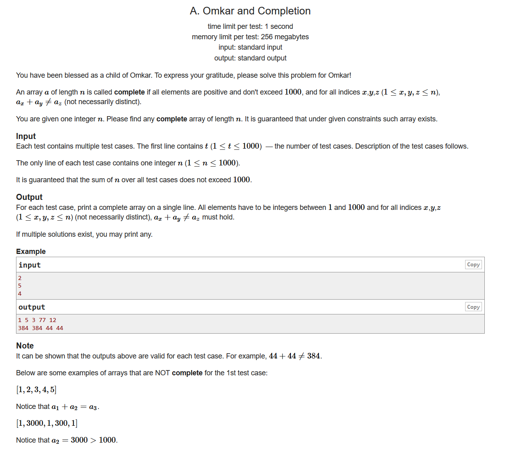
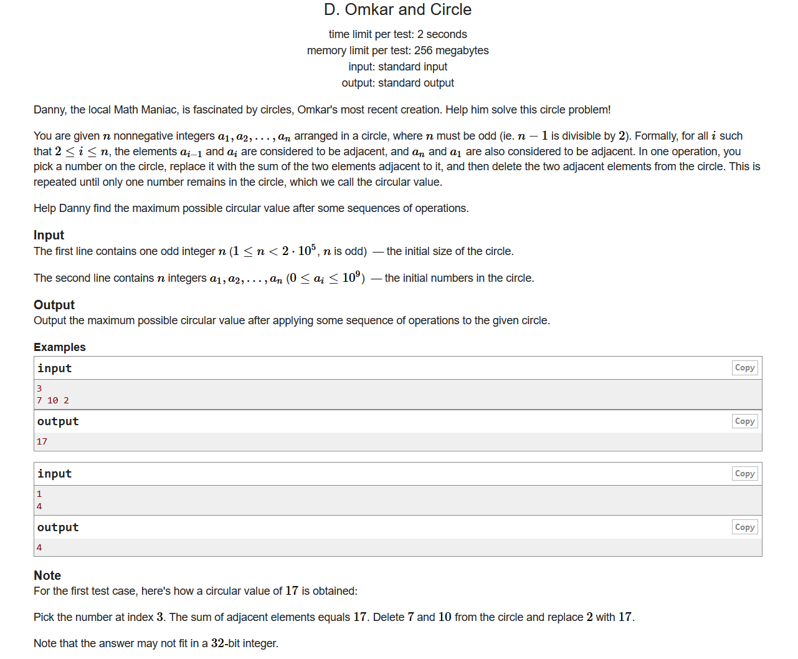
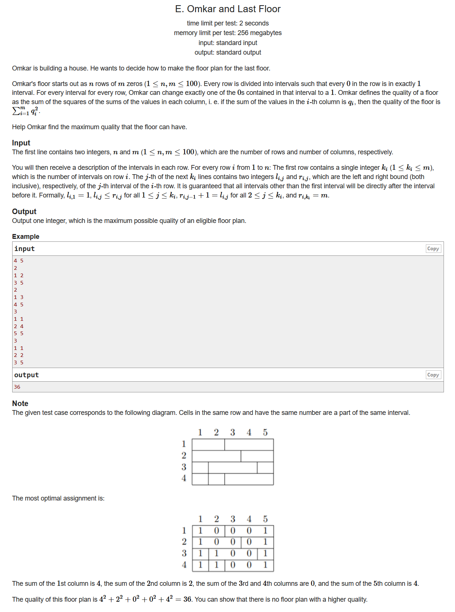

# Codeforces Round #655 (Div. 2)

[题目链接](https://codeforces.ml/contest/1372/problems)
[官方题解](https://codeforces.ml/blog/entry/79974)

## A. Omkar and Completion



- 构造
- 我们可以让每个数字都是奇数，因为奇数+奇数是一个偶数，所以不可能存在有两个数加起来等于第三个数。其中，我们可以每个奇数都重复两次，这样可以避免最大的数字超过1000

```cpp
#include <bits/stdc++.h>
using namespace std;
#define LL long long
#define sigma_size 30
#define max_size (int)(1e6+10)
#define MAX (int)(1e5+7)

int main ()
{
	ios::sync_with_stdio(0);
	int T ; cin >> T;
	while (T--)
	{
		int n ; cin >> n;
		int cur = 1;
		for ( int i = 1 ; i <= n ; i++ )
		{
			cout << cur << " ";
			if ( i % 2 == 0 ) cur += 2 ;
		}
		cout << endl;
	}
}
```

## B. Omkar and Last Class of Math


- 枚举
- 没啥好说的，就是能够是平分自然是最好，不然就是三等分，四等分。。。一个一个枚举一下就行了

```cpp
#include <bits/stdc++.h>
using namespace std;
#define LL long long
#define sigma_size 30
#define max_size (int)(1e5+10)
#define MAX (int)(1e5+7)

int main ()
{
	ios::sync_with_stdio(0);
	int T ; cin >> T;
	while (T--)
	{
		int n ; cin >> n;
		bool flag = false;
		for ( int i = 2 ; i*i <= n ; i++ )
		{
			if ( n % i ) continue;
			flag = true;
			cout << n / i << " " << ( n / i ) * ( i - 1 ) << endl;
			break;
		}
		if ( !flag ) cout << "1 " << n-1 << endl;
	}
}
```

## C. Omkar and Baseball


- 思维，结论
- 如果一开始所有的数字都在应该的位置上，那么$ans= 0$
- 如果全都不在应该在的位置上，那么$ans=1$
- 如果部分在应该在的位置上部分不在，那么除非这一堆位置正确的数字占据了首尾的若干个数字(此时答案为1)，不然的话答案为2

```cpp
#include <bits/stdc++.h>
using namespace std;
#define LL long long
#define sigma_size 30
#define max_size (int)(2e5+10)
#define MAX (int)(1e5+7)

int ans[105];
int a[max_size];
int main ()
{
	ios::sync_with_stdio(0);
	int T ; cin >> T;
	for ( int cas = 1 ; cas <= T ; cas++ )
	{
		int n ; cin >> n;
		for ( int i = 1 ; i <= n ; i++ ) cin >> a[i];
		bool flag = true;
		for ( int i = 1 ; i <= n ; i++ )
			if ( a[i] != i )
			{
				flag = false;
				break;
			}
		if ( flag ) { ans[cas] = 0 ; continue ;}
		for ( int i = 1 ; i <= n ; i++ )
			if ( a[i] == i )
			{
				flag = true;
				break;
			}
		if ( !flag )
			ans[cas] = 1;
		else
		{
			int left , right;
			for ( left = 1 ; left <= n ; left++ )	
				if ( a[left] != left )
					break;
			for ( right = n ; right >= 1 ; right-- )
				if ( a[right] != right )
					break;
			bool res = true;
			for ( int i = left ; i <= right ; i++ )
				if ( a[i] == i )
				{
					res = false;
					break;
				}
			if ( res ) ans[cas] = 1;
			else ans[cas] = 2;
		}
	}
	for ( int i = 1 ; i <= T ; i++ )
		cout << ans[i] << endl;
}
```

## D. Omkar and Circle



- 贪心，前缀和
- 表面上我们每次删除的是$a_i$两边两个数字，其实我们整个数列的总和$sum$是删除了$a_i$单独的这个数字，为了保证剩下的数字和是最大的，我们相当于得删除$n/2$个不连续的数字，这样我们可以计算剩下的$(n+1)/2$个数字和是最大的
- 这样一来我们知道，删除的数字当中间隔为1，而且有且仅有一个区间间隔为2.我们枚举一下这个间隔为2的区间就行了

```cpp
#include <bits/stdc++.h>
using namespace std;
#define LL unsigned long long
#define sigma_size 30
#define max_size (int)(2e5+10)
#define MAX (int)(1e5+7)

LL a[max_size];
LL dp[max_size][3];
LL sum = 0;
int main ()
{
	ios::sync_with_stdio(0);
	int n ; cin >> n;
	for ( int i = 1 ; i <= n ; i++ ) cin >> a[i];
	for ( int i = 1 ; i <= n ; i++ )
	{
		sum += a[i];
		dp[i][1] = dp[i-1][1];
		dp[i][2] = dp[i-1][2];
		if ( i % 2 ) dp[i][1] += a[i];
		else dp[i][2] += a[i];
	}
	LL res = min ( dp[n-2][1] , dp[n][1] - dp[1][1] );
	for ( int i = 2 ; i <= n ; i++ )
	{
		LL t ;
		if ( i % 2 )
			t = dp[i-1][2] + dp[n][1] - dp[i][1];
		else t = dp[i-1][1] + dp[n][2] - dp[i][2];
		res = min ( res , t );
	}
	cout << sum - res << endl;
}
```

## E. Omkar and Last Floor



- 区间dp
- 用$dp_{l,r}$表示区间[l,r]当中的最大值，我们可以枚举中间的某一列k，使得这个k列尽可能的填充1，那么转态转移方程为
  $$dp[i][j] = max (dp[i][k-1] + val(k) + dp[k+1][j] ) $$

```cpp
#include <bits/stdc++.h>
using namespace std;
#define LL long long
#define sigma_size 30
#define max_size (int)(3e5+10)
#define MAX (int)(1e5+7)

int n , m ;
int lef[105][105] , righ[105][105];
LL dp[105][105];
int main ()
{
    ios::sync_with_stdio(0);
    cin >> n >> m;
    for ( int i = 1 ; i <= n ; i++ )
    {
        int k ; cin >> k;
        while (k--)
        {
            int x , y;
            cin >> x >> y;
            for ( int j = x ; j <= y ; j++ )
                lef[i][j] = x , righ[i][j] = y;
        }
    }
    
    for ( int len = 1 ; len <= m ; len++ )
    {
        for ( int i = 1 ; i + len - 1 <= m ; i++ )
        {
            int j = i + len - 1 ;
            for ( int k = i ; k <= j ; k++ )
            {
                int a = 0;
                for ( int w = 1 ; w <= n ; w++ )
                    if ( lef[w][k] >= i && righ[w][k] <= j )
                        a++;
                dp[i][j] = max ( dp[i][j] , dp[i][k-1] + a*a + dp[k+1][j] );
            }
        }
    }
    cout << dp[1][m] << endl;
}
```