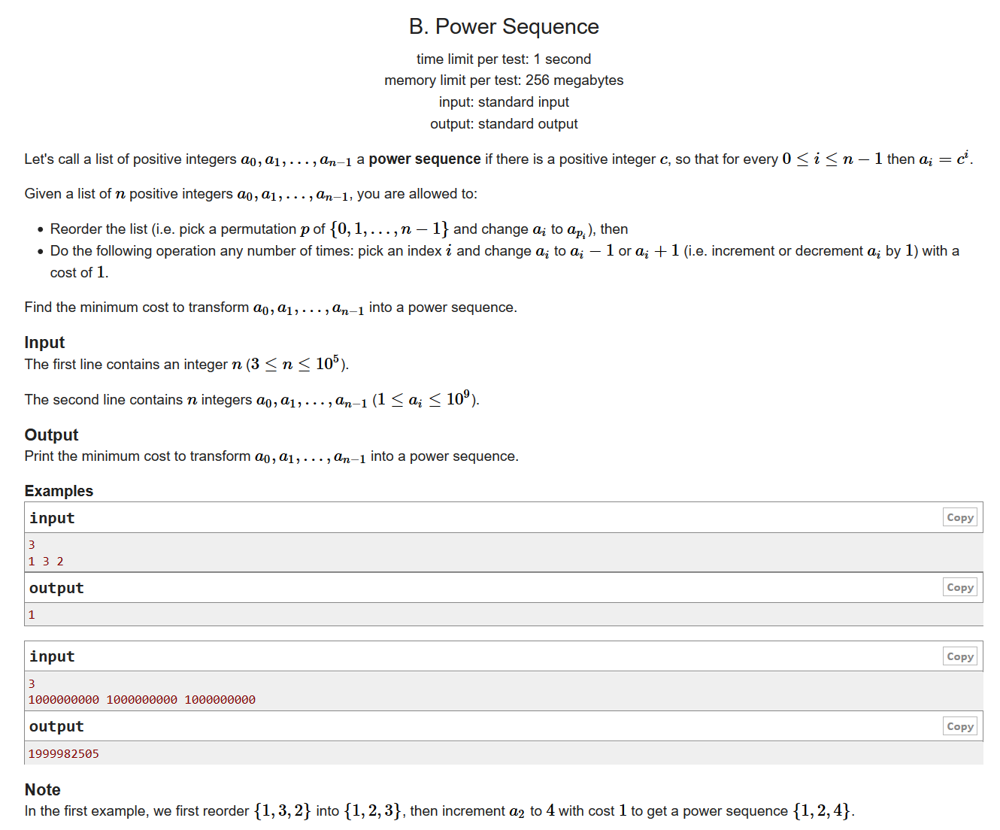
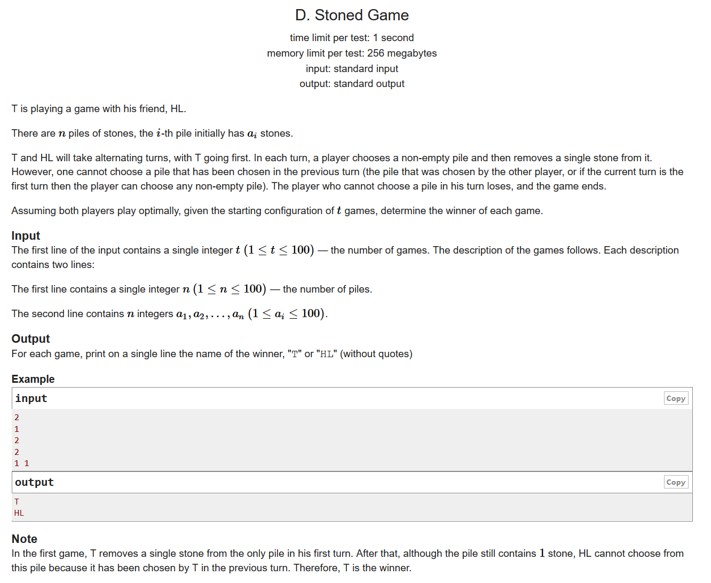
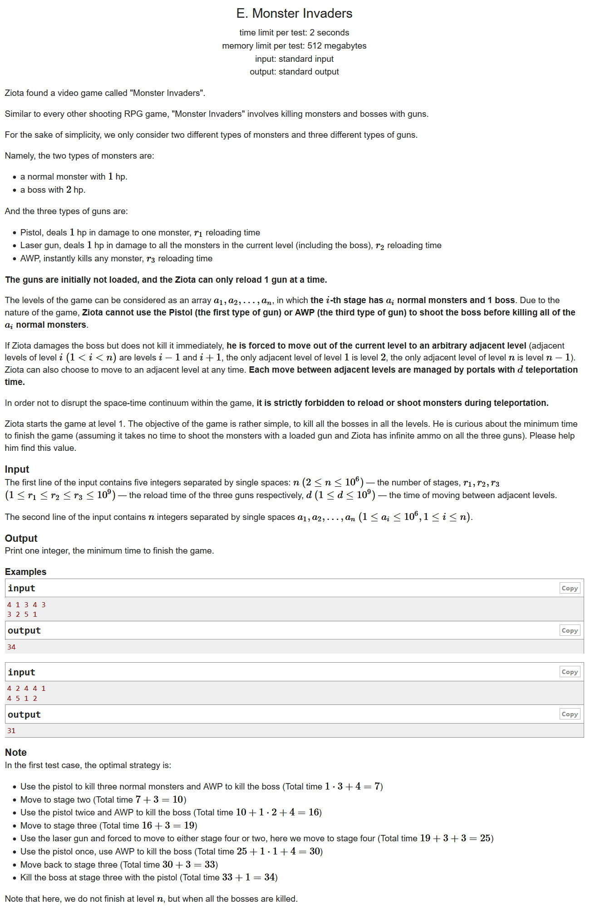

# Codeforces Round #666 (Div. 2)

- https://codeforces.ml/contest/1397/problems

## A. Juggling Letters


- 签到题
- 统计每个字母出现的次数能否整除n即可

```cpp
#include <bits/stdc++.h>
using namespace std;
#define LL long long
#define sigma_size 30
#define max_size (int)(1e5+10)
#define MAX (int)(1e5+7)

int ans[max_size];
int main ()
{
	ios::sync_with_stdio(0);
	int T ; cin >> T;
	for ( int cas = 1  ; cas <= T ; cas++ )
	{
		int n ; cin >> n;
		int Hash[30];
		memset ( Hash , 0 , sizeof(Hash) ); 
		for ( int i = 1 ; i <= n ; i++ )
		{
			string s;
			cin >> s;
			for ( int j = 0 ; j < s.length() ; j++ )
				Hash[(int)(s[j]-'a'+1)]++;
		}
		bool flag = true;
		for ( int i = 1 ; i <= 26 ; i++ )
			if ( Hash[i] % n )
			{
				flag = false;
				break;
			}
		ans[cas] = flag;
	}
	for ( int i = 1 ; i <= T ; i++ )
		if ( ans[i] ) cout << "YES" << endl;
		else cout << "NO" << endl;
}
```

## B. Power Sequence


- 枚举，暴力
- 我们首先应该看到，$a_i$最多也就$ 10^9 $，然而如果c比2更大的时候，$2^{10^5}$是我们绝对不能接受的数字，那么就表示如果n非常大的时候c只能取1
- 但是不排除数字不多的情况，c可以取到2,3,4...那么我们可以枚举每个c的可能性，带进去算算这个数列的差值，我们可以很容易得到，随着c的增大，这个差值应该是先递减后递增的。那么我们就可以很容易的取到最小值了

```cpp
#include <bits/stdc++.h>
using namespace std;
#define LL long long
#define sigma_size 30
#define max_size (int)(1e5+10)
#define MAX (int)(1e5+7)

LL a[max_size];
int main ()
{
	ios::sync_with_stdio(0);
	int n ; cin >> n;
	for ( int i = 1 ; i <= n ; i++ ) cin >> a[i];
	sort ( a+1 , a+1+n );
	LL res = 1ll << 60;
	for ( int c = 1 ; ; c++ )
	{
		LL base = c;
		LL tmp = abs(a[1] - 1);
		for ( int i = 2 ; i <= n ; i++ )
		{
			tmp += abs(a[i]-base);
			base *= 1ll*c;
			if ( tmp > res ) break;
		}
		if ( tmp < res ) res = tmp;
		else break;
	}
	cout << res << endl;
}
```

## C. Multiples of Length


- 数学，构造
- 我们可以先对区间(1,n-1)进行操作，然后对(n,n)进行操作，最后对于(1,n)进行操作。证明如下：
    因为最后是要对区间(1,n)进行操作的，所以最后每个数字都应该是n的倍数
    
    对于区间(1,n-1)，我们需要分别构造一个数，使得他们加上原来的数字之后是n的倍数，这个构造的式子:

    $$
    \begin{aligned}
        (a_i+k*(n-1)) \space mod \space n &= 0 \\
        a_i \space mod \space n + k*(n-1) \space mod \space n &= n \\
        k*(n-1) \space mod \space n &= n-a_i\space mod\space n
    \end{aligned}  
    $$

    由这个式子我们可以知道，不管$a_i$取什么数字，我们都可以通过k构造出右边的式子，即$ k = n - d ( d = n - a_i \space mod \space n ) $
- 最后别忘了考虑n=1的情况

```cpp
#include <bits/stdc++.h>
using namespace std;
#define LL long long
#define sigma_size 30
#define max_size (int)(1e5+10)
#define MAX (int)(1e5+7)

LL a[max_size];
int main ()
{
	ios::sync_with_stdio(0);
	int n ; cin >> n;
	for ( int i = 1 ; i <= n ; i++ ) cin >> a[i];
	if ( n == 1 )
	{
		cout << "1 1" << endl;
		cout << -a[1] << endl;
		cout << "1 1" << endl;
		cout << "0" << endl;
		cout << "1 1" << endl;
		cout << "0" << endl;
		return 0;
	}
	
		cout << "1 " << n-1 << endl;
		for ( int i = 1  ; i <= n-1 ; i++ )
		{
			LL d = n - a[i] % n;
			LL k = n - d;
			a[i] += k*(n-1);
			cout << k*(n-1) << " ";
		}
		cout << endl;
		cout << n << " " << n << endl;
		
		LL d = n - a[n] % n;
		cout << d << endl;
		a[n] += d;
		cout << "1 " << n << endl;
		for ( int i = 1 ; i <= n ; i++ )
			cout << -a[i] << " ";
		cout << endl;
	
}
```

## D. Stoned Game



- 博弈
- 我们先从最简单的情况开始考虑，如果现在只有一堆石头，那么先手必胜
- 如果现在有多堆石头，并且最多的那一堆大于其他数字加起来，那么先手必胜
- 那么现在我们假设，谁先抢到非常突出的那堆石头，谁就获胜。设这堆石头是x个，我们可以知道如果x=5，总数为9的话，先手必胜；以此类推，如果x=3，总数为5。。。争论到最后就是只剩下一棵石头。谁最后拿到这个石头，谁就获胜
- 对于先手来讲，肯定希望这个突出的部分更加突出一点，对于后手来说，肯定希望不要有特别突出的石头，因此每次都会削弱一部分。问题到了最后就变成了一开始总数的奇偶性问题了

```cpp
#include <bits/stdc++.h>
using namespace std;
#define LL long long
#define sigma_size 30
#define max_size (int)(1e5+10)
#define MAX (int)(1e5+7)

bool ans[105];
int main ()
{
	ios::sync_with_stdio(0);
	int T ; cin >> T;
	for ( int cas = 1 ; cas <= T ; cas++ )
	{
		int n ; cin >> n;
		int sum = 0;
		int maxx = 0;
		for ( int i = 1 ; i <= n ; i++ )
		{
			int a ; cin >> a;
			sum += a;
			maxx = max ( maxx , a );
		}
		if ( maxx > sum - maxx ) ans[cas] = 1;
		else
		{
			if ( sum % 2 ) ans[cas] = 1;
			else ans[cas] = 0;
		}
	}
	for ( int i = 1 ; i <= T ; i++ )
		if ( ans[i] ) cout << "T" << endl;
		else cout << "HL" << endl;
}
```

## E. Monster Invaders



- 贪心，dp
- 我们开一个dp[max_size][2],第一维表示的是关卡的总数，第二维表示的是该关卡boss的血量。我们可以得到状态dp[i][1]和dp[i][0]
- 如果上一关还有一只boss没打完，那么根据贪心的思想，我们应该跳到上一关用手枪解决掉boss再回来
- 如果我们要把boss打到0血，有三种情况：

    (1)手枪打死小怪，最后用斩杀枪打死boss
    (2)手枪打死小怪，然后回到上一关用手枪把boss打掉，再回来用斩杀枪打掉这只boss
    (3)先把boss打到一血，然后回到上一关手枪打掉boss，再回来手枪打掉boss
    其中把boss打到一血直接比较一下用AOE快还是手枪快

- 如果把boss打到一血，又有两种情况：

    (1)AOE
    (2)手枪慢慢打

```cpp
#include <bits/stdc++.h>
using namespace std;
#define LL long long
#define sigma_size 30
#define max_size (int)(1e6+10)
#define MAX (int)(1e5+7)

LL a[max_size];
LL dp[max_size][2];
int main ()
{
    ios::sync_with_stdio(0);
    LL n , r1 , r2 , r3 , d ;
    cin >> n >> r1 >> r2 >> r3 >> d;
    for ( int i = 1 ; i <= n ; i++ ) cin >> a[i];

    memset ( dp , 0xffffffff , sizeof(dp) );
    dp[1][0] = r1*a[1] + r3;
    dp[1][1] = min ( r2 , r1*a[1] + r1 );

    for ( int i = 2 ; i <= n ; i++ )
    {
        dp[i][0] = min ( r1*a[i] + r3 + dp[i-1][0] , min( dp[i-1][1]+2*d+r1+a[i]*r1+r3 , dp[i-1][1]+2*r1+2*d+min(a[i]*r1+r1,r2) ) ) + d;
        dp[i][1] = min ( dp[i-1][0]+min(a[i]*r1+r1,r2) , dp[i-1][1]+2*d+r1+min(a[i]*r1+r1,r2) ) + d;
    }
    cout << min ( dp[n][0] , dp[n-1][1] + 2*d + r1 + a[n]*r1+r3 ) << endl;
}
```

