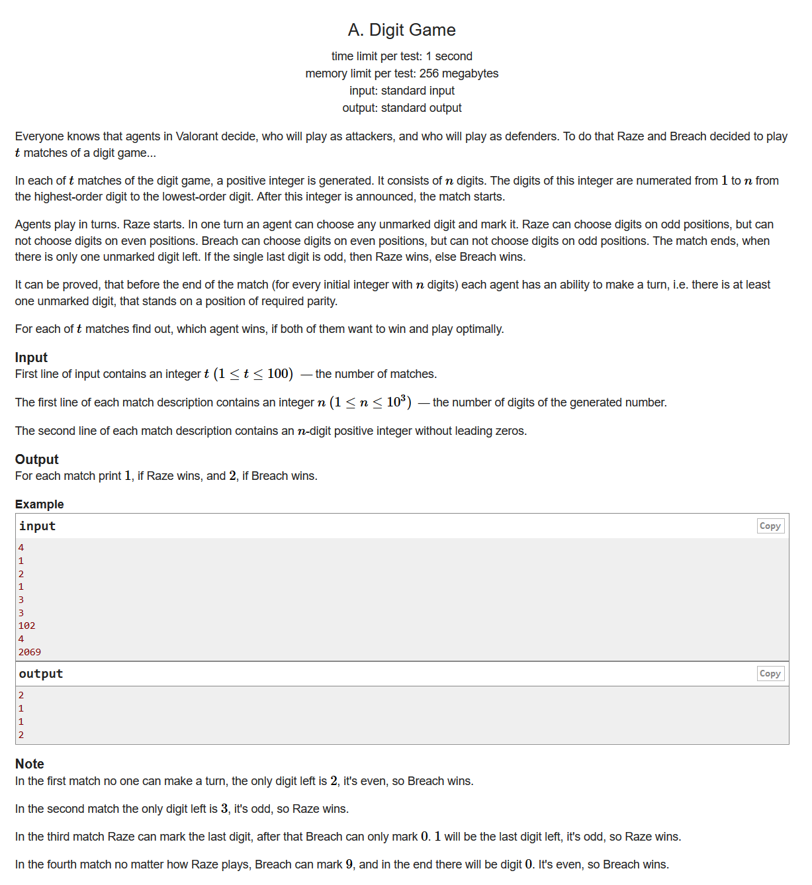
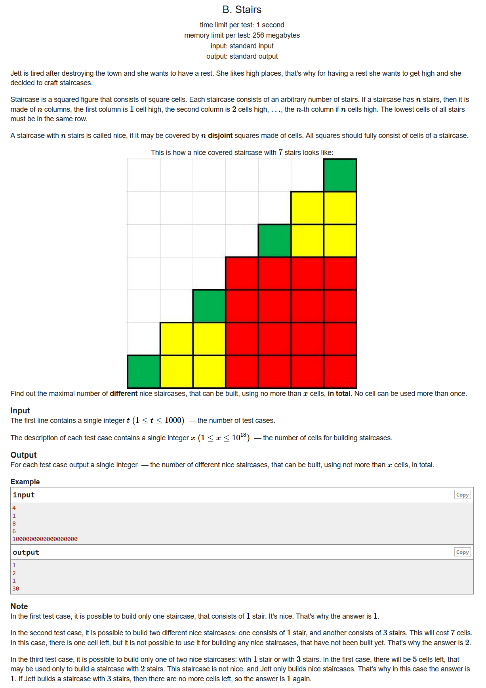
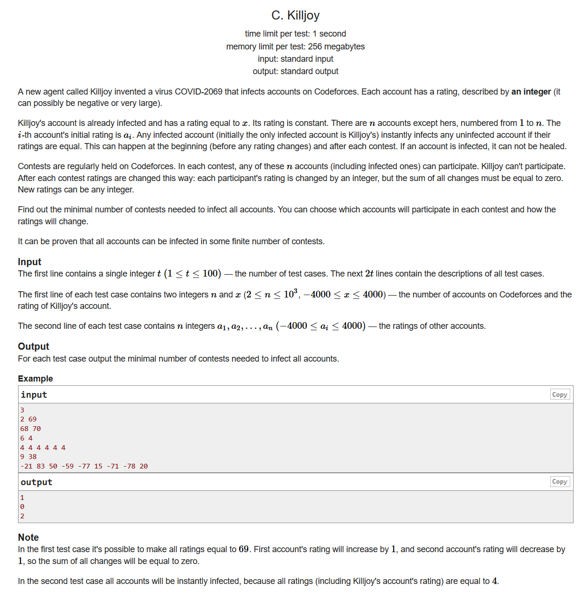
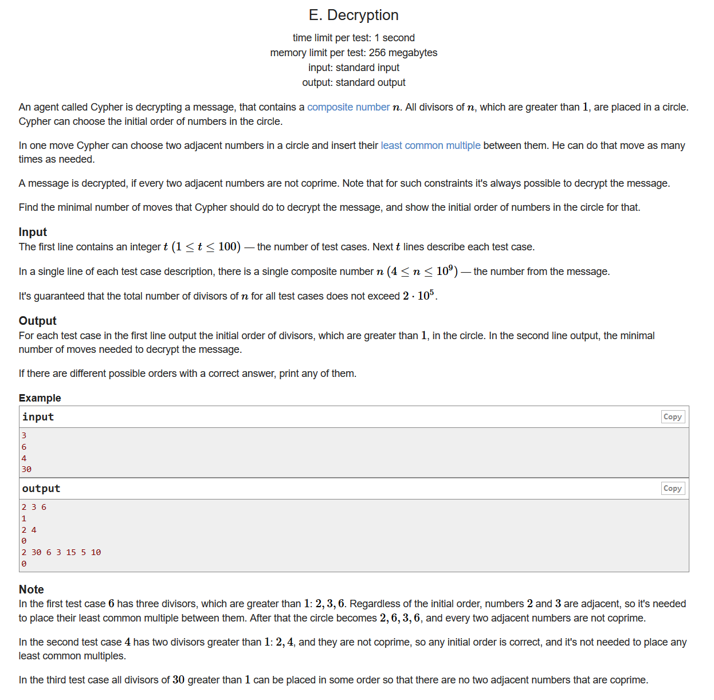

# Codeforces Round #671 (Div. 2)

- [题目链接](https://codeforces.ml/contest/1419)
- [官方题解](https://codeforces.ml/blog/entry/82817)

## A. Digit Game



- 签到
- 明明很简单的一道题不知道为啥想了这么久
- 如果n是奇数的话，那么最后留下的一定是奇数位置的数字，这个时候我们只需要看看奇数位置上有没有一个奇数就行了，我们最后保留一下它
- 偶数的话同理
  
```cpp
#include <bits/stdc++.h>
using namespace std;
#define LL long long
#define sigma_size 30
#define max_size (int)(2e4+10)
#define MAX (int)(1e5+7)

int ans[105];
int main ()
{
	ios::sync_with_stdio(0);
	int T ; cin >> T;
	for ( int cas = 1; cas <= T ; cas++ )
	{
		int n ; cin >> n;
		string s ; cin >> s;
		s = ' ' + s;
		int cnt1 = 0 , cnt2 = 0;
		for ( int i = 1 ; i <= n ; i++ )
		{
			if ( i % 2 && (int)(s[i]-'0') % 2 )
				cnt1++;
			if ( i % 2 == 0 && (int)(s[i]-'0') % 2 == 0 )
				cnt2++;
		}
		if ( n % 2 )
		{
			if ( cnt1 >= 1 )
				ans[cas] = 1;
			else ans[cas] = 2;
		}
		else
		{
			if ( cnt2 >= 1 )
				ans[cas] = 2;
			else ans[cas ] = 1;
		}
		
		
	}
	for ( int i = 1 ; i <= T ; i++ )
		cout << ans[i] << endl;
}
```

## B. Stairs



- 思维，贪心
- 观察图形我们可以得到，能够组成楼梯的列数只有1，3，7，...$2^n-1$,那么我们首先把这些数字需要消耗的cell数目算出来，然后我们根据贪心的想法，从小到大看看能够摆下多少个楼梯
```cpp
#include <bits/stdc++.h>
using namespace std;
#define LL long long
#define sigma_size 30
#define max_size (int)(2e4+10)
#define MAX (int)(1e5+7)

int ans[1005];
LL fac[70];
void init()
{
	fac[1] = 1;
	for ( int i = 2 ; (1ll<<i) <= 1e18 ; i++ )
	{
		LL cur = (1LL<<i) - 1;
		LL sum = ( 1 + cur ) * cur / 2ll ;
		fac[i] = sum;
	}
}
int main ()
{
	ios::sync_with_stdio(0);
	init();
	int T ; cin >> T;
	for ( int cas = 1 ; cas <= T ; cas++ )
	{
		LL x ;
		cin >> x;
		int cnt = 0;
		int i = 1;
		while ( x > 0 )
		{
			x -= fac[i++];
			if ( x >= 0 )
				cnt++;
		}
		ans[cas] = cnt;
	}
	for ( int i = 1 ; i <= T ; i++ )
		cout << ans[i] << endl;
}
```

## C. Killjoy



- 思维，结论
- 我们考虑一下几种情况
  - 至少有一个数字已经被感染了：
    这种情况下我们只需要进行一次比赛即可，我们可以把所有的数字都进行一次比赛，把其他的数字调整到与x相同，然后调整已经被感染的数字使得最后的changes等于0就行。特殊情况，如果所有数字都等于x了，那么不用进行
  - 如果所有数字的平均数已经等于x了，那么直接1次比赛可以进行
  - 不然的话，2次就够

```cpp
#include <bits/stdc++.h>
using namespace std;
#define LL long long
#define sigma_size 30
#define max_size (int)(2e5+10)
#define MAX (int)(1e5+7)

int ans[105];
int a[1005];
int main ()
{
    ios::sync_with_stdio(0);
    int T ; cin >> T ;
    for ( int cas = 1 ; cas <= T ; cas++ )
    {
        int n , x;
        cin >> n >> x;
        for ( int i =1  ; i <= n ; i++ ) cin >> a[i];
        int sum = 0;
        for ( int i =1 ; i <= n ; i++ ) sum += a[i];
        bool flag = 0;
        for ( int i =1 ;  i <= n ; i++ )
            if ( a[i] == x )
            {
                flag = 1;
                break;
            }
        if ( flag ) 
        {
            for ( int i = 1  ; i <= n ; i++ )
                if ( a[i] != x )
                {
                    flag = 0;
                    break;
                }
            if ( flag) ans[cas] = 0;
            else ans[cas] = 1;
        }
        else if ( sum == n * x )
            ans[cas] = 1;
        else ans[cas] = 2;
    }
    for ( int i =1 ; i <= T ; i++ )
        cout << ans[i] << endl;
}
```

## D1. Sage's Birthday (easy version)


- 思维，结论

```cpp
#include <bits/stdc++.h>
using namespace std;
#define LL long long
#define sigma_size 30
#define max_size (int)(1e5+10)
#define MAX (int)(1e5+7)

int n;
int a[max_size];
int b[max_size];
int main ()
{
	ios::sync_with_stdio(0);
	cin >> n;
	for ( int i = 1 ; i <= n ; i++ ) cin >> a[i];
	sort ( a + 1 , a + 1 + n );
	int j = n / 2 + 1;
	int cnt = 0;
	int i = 1 ;
	int tot = 0;
	while ( j <= n && i <= n / 2  )
	{
		b[++tot] = a[j];
		b[++tot] = a[i];
		if ( a[j] > a[i]  && a[j+1] > a[i] )
			cnt++;
		j++ ; i++;
	}
	if ( j == n ) b[++tot] = a[j];
	cout << cnt << endl;
	for ( int i =1 ; i <= tot ; i++ )
		cout << b[i] << " ";
	cout << endl;
}
```

## E. Decryption



- 数学，结论题
- 因为任何一个数字都可以写成是$n = p_1^{q_1}p_2^{q_2}...p_k^{q_k}$的形式，因此我们可以这样来解决
- 考虑一下比较极端的情况，如果这个数的质因数只有$p_1p_2$,并且都只有1次，那么我们可以得到这个排列序列：$p_1,p_1*p_2=n,p_2,p_1*p_2=n$这个时候我们只需要添加一个数字n即可
- 其他情况的话，我们就先把$p_1p_2p_3...p_n$排列成一个圈，然后我们把$p_1*p_2,p_2*p_3,p_3*p_4...$塞进去，还有一些剩下的没有用过的因数，我们就选择p1p2的倍数塞到$p_1$的后面，其他的数字以此类推，最后我们得到的答案就是0；

```cpp
#include <bits/stdc++.h>
using namespace std;
#define LL long long
#define sigma_size 30
#define max_size (int)(2e5+10)
#define MAX (int)(1e5+7)

bool mark[max_size];
int pri[max_size];
void get_pri()
{
    int cnt = 0;
    for ( int i = 2 ; i < max_size ; i++ )
    {
        if ( !mark[i] ) pri[++cnt] = i;
        for ( int j = 1 ; j <= cnt && i*pri[j] < max_size ; j++ )
        {
            mark[i*pri[j]] = 1;
            if ( i % pri[j] == 0 ) break;
        }
    }
}

LL num[max_size];
LL cnt[max_size];
LL fac[max_size];
int tot;
int tot2;
unordered_map<int,bool> mp;
void init()
{
    memset ( num , 0 , sizeof(num) );
    memset ( cnt , 0 , sizeof(cnt) );
    memset ( fac , 0 , sizeof(fac) );
    mp.clear();
    tot = 0;
    tot2 = 0;
}

int main ()
{
    ios::sync_with_stdio(0);
    get_pri();
    int T ; cin >> T;
    while (T--)
    {
        int n ; cin >> n;
        init();
        for ( int i = 2 ; i*i <= n ; i++ )
        {
            if ( n % i ) continue;
            fac[++tot2] = i;
            if ( i != n / i )
                fac[++tot2] = n / i;
        }
        fac[++tot2] = n;
        sort ( fac+1 , fac+1+tot2 ) ;


        for ( int i = 1 ; pri[i]*pri[i] <= n ; i++ )
        {
            if ( n % pri[i] ) continue;
            num[++tot] = pri[i];
            int counts = 0;
            while ( n % pri[i] == 0 )
            {
                counts++;
                n /= pri[i];
            }
            cnt[tot] = counts;
        }
        if ( n > 1 ) 
        {
            num[++tot] = n;
            cnt[tot] = 1;
        }


        if ( tot == 2 && cnt[1] == 1 && cnt[2] == 1 )
        {
            cout << num[1] << " " << num[2] << " " << num[1]*num[2] << endl;
            cout  << "1" << endl;
        }
        else
        {
            vector <int> connect;
            for ( int i = 1 ; i <= tot ; i++ )
            {
                int p = num[i] , q = num[i%tot+1];
                for ( int j = 1 ; j <= tot2 ; j++ )
                {
                    if ( mp[fac[j]] || fac[j] % p || fac[j] % q ) continue;
                    mp[fac[j]] = 1;
                    connect.push_back(fac[j]);
                    break;
                }
            }
            for ( int i = 1 ; i <= tot ; i++ )
            {
                int p = num[i];
                mp[p] = 1;
                cout << p << " ";
                for ( int j = 1 ; j <= tot2 ; j++ )
                {
                    if ( mp[fac[j]] || fac[j] % p ) continue;
                    mp[fac[j]] = 1;
                    cout << fac[j] << " ";
                }
                if ( tot > 1 )
                    cout << connect[i-1] << " ";
            }
            cout << endl << 0 << endl;
        }
        
    }
}
```

## F. Rain of Fire