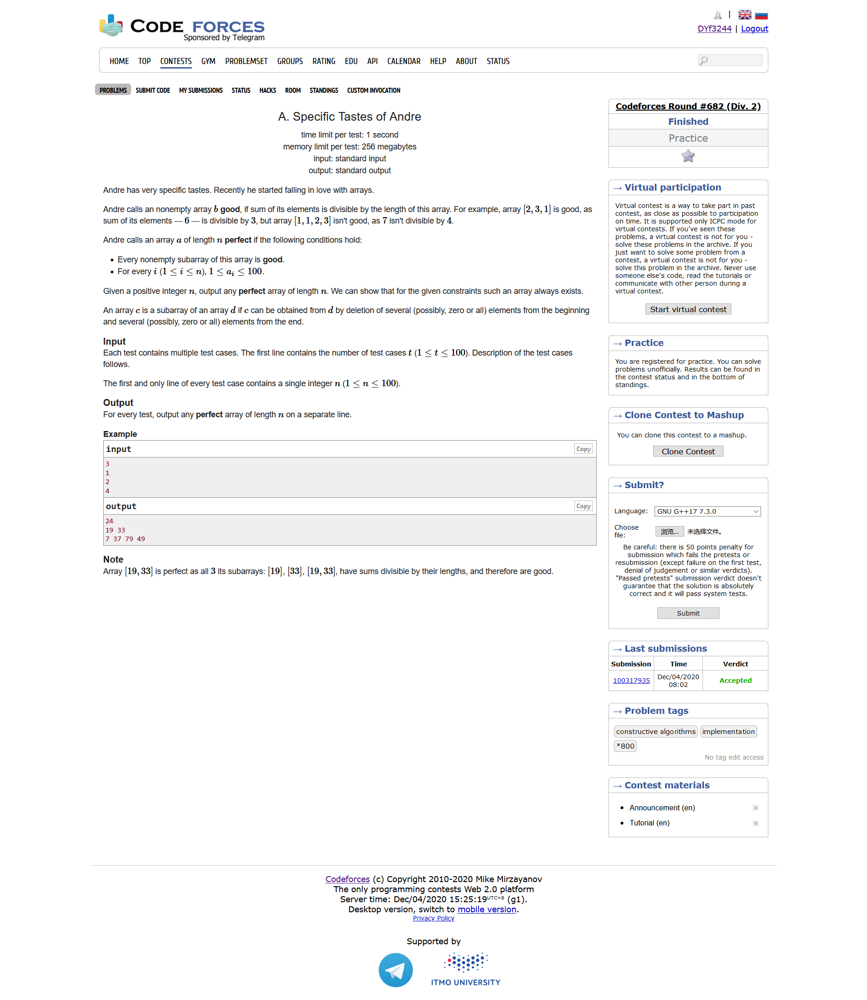
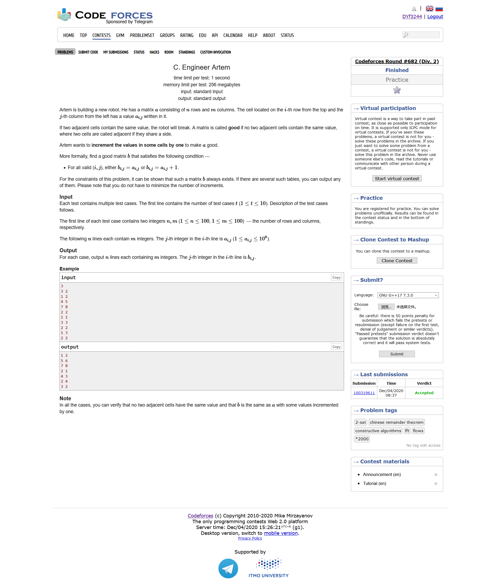
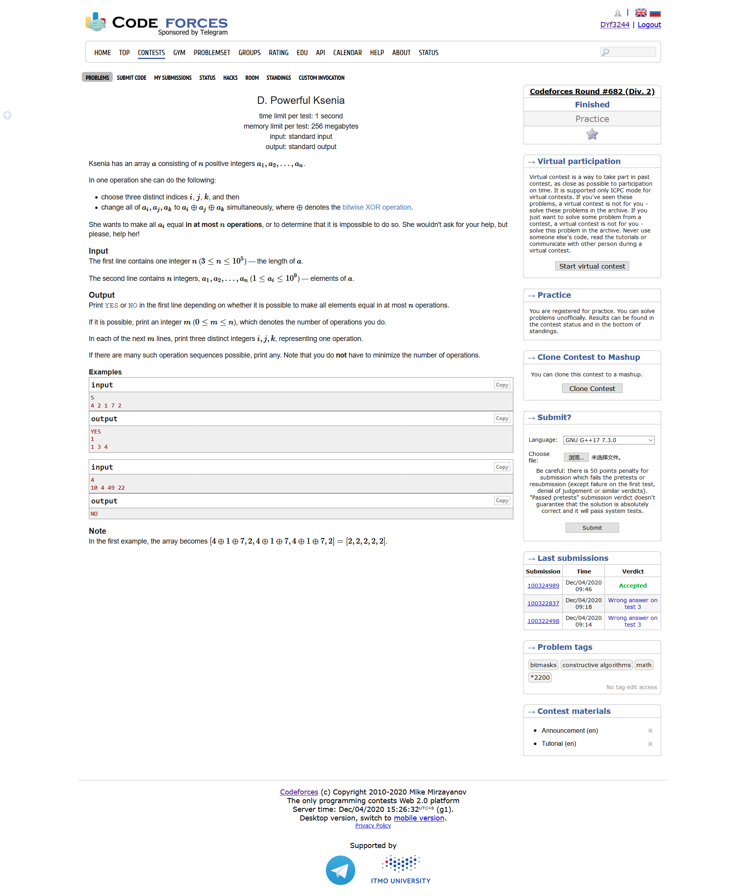
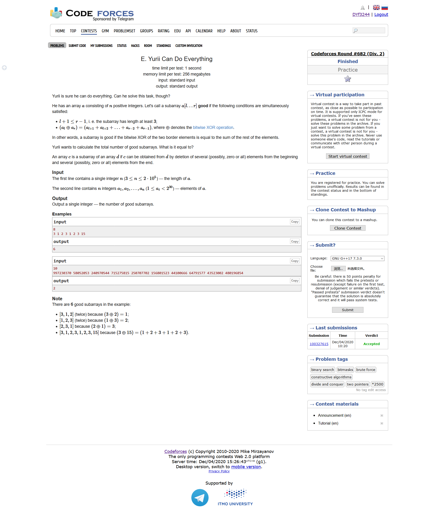

# Codeforces Round #682 (Div. 2)

https://codeforces.ml/contest/1438

https://codeforces.ml/blog/entry/84589

## [A. Specific Tastes of Andre](https://codeforces.ml/contest/1438/problem/A)



- 题目大意：构造一个长度为n的数组，使得任何一个子区间的和能够被该区间的长度整除
- 构造
- 全都输出1即可

```cpp
#include <bits/stdc++.h>
using namespace std;
#define LL long long
#define sigma_size 30
#define max_size (int)(1e5+10)
#define MAX (int)(1e5+7)

int main ()
{
	ios::sync_with_stdio(0);
	int T ; cin >> T;
	for ( int cas = 1 ;cas <= T ; cas++ )
	{
		int n ; cin >> n;
		for ( int i = 1 ; i <= n ; i++ )
			cout << "1 " ;
		cout << endl;
	}
}
```

## [B. Valerii Against Everyone](https://codeforces.ml/contest/1438/problem/B)


- 题目大意：给定一个数组b，问是否存在四个整数$l_1,r_1,l_2,r_2$使得：$1\le l_1 \le r_1 < l_2 \le r_2 \le n$并且$a_{l_1}+a_{l_1+1}+...+a_{r_1-1}=a_{l_2}+a_{l_2+1}+...+a_{r_2}$，其中$a_i = 2^{b_i}$
- 结论题
- 如果数组当中有两个数字是相等的，那么一定会存在；如果不相等，那么一定不存在

```cpp
#include <bits/stdc++.h>
using namespace std;
#define LL long long
#define sigma_size 30
#define max_size (int)(2e5+10)
#define MAX (int)(1e5+7)

bool ans[max_size];
LL b[1005];
int main ()
{
	ios::sync_with_stdio(0);
	int T ; cin >> T;
	for ( int cas = 1 ; cas <= T ; cas++ )
	{
		int n ; cin >> n;
		for ( int i = 1 ; i <= n ; i++ ) cin >> b[i];
		bool flag = 0 ; 
		for ( int i = 1 ; i <= n ; i++ )
		{	
			for ( int j = 1 ; j <= n ; j++ )
				if ( i != j && b[i] == b[j] ) 
				{
					flag = 1;
					break;			
				}
			if ( flag ) break;
		}
		if ( flag ) 
		{
			ans[cas] = flag ;
			continue;
		} 
		ans[cas]  =0  ;
	} 
	for ( int i = 1 ; i <= T ; i++ )
		if ( ans[i] ) cout << "YES" << endl;
		else cout << "NO" << endl;
}
```

## [C. Engineer Artem](https://codeforces.ml/contest/1438/problem/C)



- 题目大意：给定一个矩阵a，求构造一个矩阵b，有$b[i][j]=a[i][j]或者b[i][j]=a[i][j]$使得b当中相邻的元素互不相同
- 构造
- 我们让i+j为奇数的位置上设置奇数，i+j为偶数的位置上设置偶数即可

```cpp
#include <bits/stdc++.h>
using namespace std;
#define LL long long
#define sigma_size 30
#define max_size (int)(1e6+10)
#define MAX (int)(1e5+7)

int a[105][105];

int main ()
{
    ios::sync_with_stdio(0);
    int T ; cin >> T;
    for ( int cas = 1 ; cas <= T ; cas++ )
    {
        int n , m ; cin >> n >> m;
        for ( int i = 1 ; i <= n ; i++ )
            for ( int j = 1 ; j <= m ; j++ )
                cin >> a[i][j];
        for ( int i = 1 ; i <= n ; i++ )
        {
            for ( int j = 1 ; j <= m ; j++ )
            {
                if ( (i+j) % 2 )
                {
                    if ( a[i][j] % 2 )
                        cout << a[i][j] << " ";
                    else cout << a[i][j] + 1 << " ";
                }
                else
                {
                    if ( a[i][j] % 2 )
                        cout << a[i][j]+1 << " ";
                    else cout << a[i][j] << " ";
                }
            }
            cout << endl;
        }
    }
    
}
```

## [D. Powerful Ksenia](https://codeforces.ml/contest/1438/problem/D)



- 题目大意：给定一个数组a，每次可以选择三个数$i,j,k$，然后$a[i]=a[j]=a[k]=a[i]\bigoplus a[j] \bigoplus a[k]$，求问是否能够在n次之内使得所有的数字都相等
- 构造
- 如果n是奇数，那么一定是可以的。我们知道，如果有两个数字$a[i],a[j]$相等，那么我们选择$i,j,k$就相当于是把$a[k]$的值赋值给$a[i],a[j]$。我们假设原来的数列是$a,b,c,d,e$，我们可以变成$x,x,x,y,y \rightarrow x,x,y,y,y \rightarrow y,y,y,y,y$
- 如果n的偶数，我们也可以利用相似的方法求解，但是我们需要判断一下前n-1个数字的异或值是否等于最后一个数字

```cpp
#include <bits/stdc++.h>
using namespace std;
#define LL long long
#define sigma_size 30
#define max_size (int)(1e6+10)
#define MAX (int)(1e5+7)

int a[max_size];
int bits[max_size][30];

int main ()
{
    ios::sync_with_stdio(0);
    int n ; cin >> n;
    for ( int i = 1 ; i <= n ; i++ ) cin >> a[i];

    int sum = 0 ; 
    for ( int i = 1 ; i <= n ; i++ ) sum ^= a[i];
    struct node {
        int i , j , k;
    };
    vector <node> ans;
    if ( n % 2 )
    {
        for ( int i = 1 ; i <= n-2 ; i+=2 )
            ans.push_back({i,i+1,i+2});
        for ( int i = 1 ; i <= n-3 ; i+=2 )
            ans.push_back({i,i+1,n});
        cout << "YES" << endl;
        cout << ans.size() << endl;
        for ( auto x : ans )
            cout << x.i << " " << x.j << " " << x.k << endl;
    }
    else
    {
        if ( sum == 0 )
        {
            for ( int i = 1 ; i <= n-3 ; i+=2 )
                ans.push_back({i,i+1,i+2});
            for ( int i = 1 ; i <= n-4 ; i+=2 )
                ans.push_back({i,i+1,n});
            cout << "YES" << endl;
            cout << ans.size() << endl;
            for ( auto x : ans )
                cout << x.i << " " << x.j << " " << x.k << endl;
        }
        else
        {
            cout << "NO" << endl;
        }
        
    }
    
}
```

## [E. Yurii Can Do Everything](https://codeforces.ml/contest/1438/problem/E)



- 题目大意：找到某个数列的区间$[l,r]$，该区间内$a[l]\bigoplus a[r] = \sum_{i=l+1}^r \limits{a_i}$
- 暴力
- 我们先固定l，取l的最高位k，然后我们改变r，我们可以知道，如果中间的和sum大于$1<<k+1$的话，就停止r的遍历，我们将得到的l，r的值记录下来作为答案
- 接下来我们需要将整个序列进行反转进行相似的操作，同时注意判重

```cpp
#include <bits/stdc++.h>
using namespace std;
#define LL long long
#define sigma_size 30
#define max_size (int)(2e5 + 10)
#define MAX (int)(1e5+7)

int n ; 
LL a[max_size];
set <pair<int,int> > s;

int ans ;

int main ()
{
    ios::sync_with_stdio(0);
    cin >> n;
    for ( int i = 1 ; i <= n ; i++ )
        cin >> a[i];
    for ( int l = 1 ; l <= n-2 ; l++ )
    {
        int k = log2(a[l]);
        LL sum = a[l+1];
        for ( int r = l+2 ; r <= n ; r++ )
        {
            if ( sum >= (1LL<<(k+1)) ) break;
            if ( (a[l] ^ a[r]) == sum )
            {    
                ans++;
                s.insert({l,r});
            }
            sum += a[r];
        }
    }
    reverse(a+1,a+1+n);
    for ( int l = 1 ; l <= n-2 ; l++ )
    {
        int k = log2(a[l]);
        LL sum = a[l+1];
        for ( int r = l+2 ; r <= n ; r++ )
        {
            if ( sum >= (1LL<<(k+1)) ) break;
            if ( (a[l] ^ a[r]) == sum )
            {    
                ans++;
                if ( s.find({n-r+1,n-l+1}) != s.end() )
                    ans--;
            }
            sum += a[r];
        }
    }
    cout << ans << endl;
}
```

## [F. Olha and Igor](https://codeforces.ml/contest/1438/problem/F)


