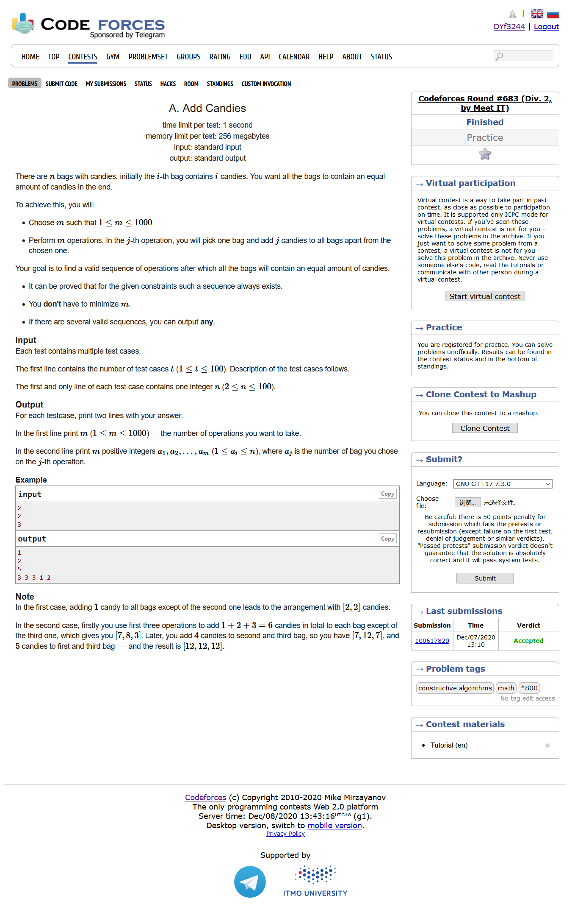
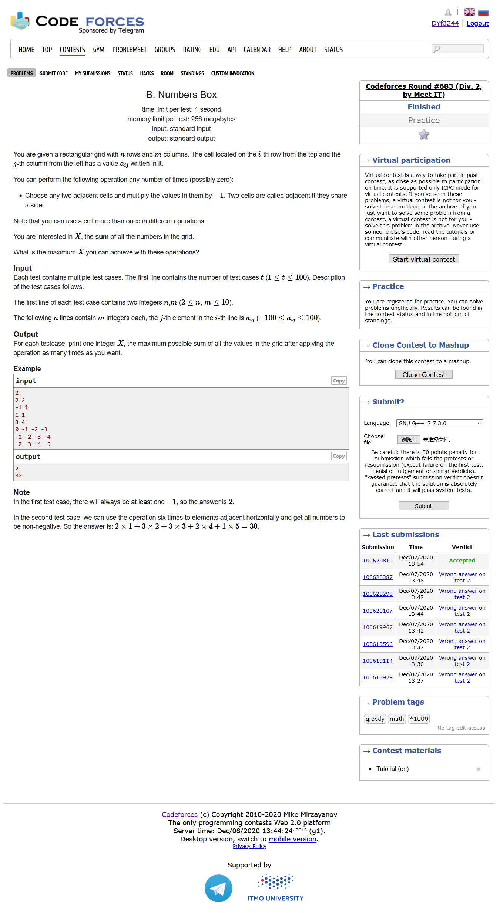
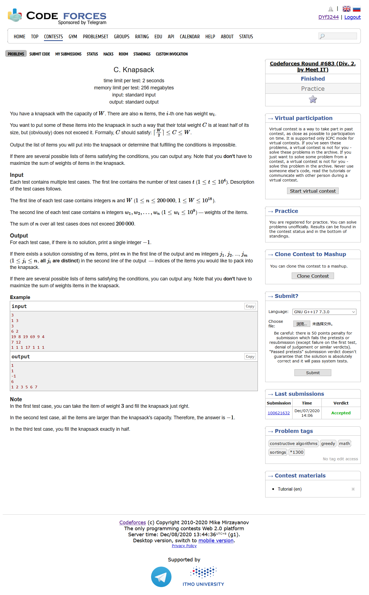
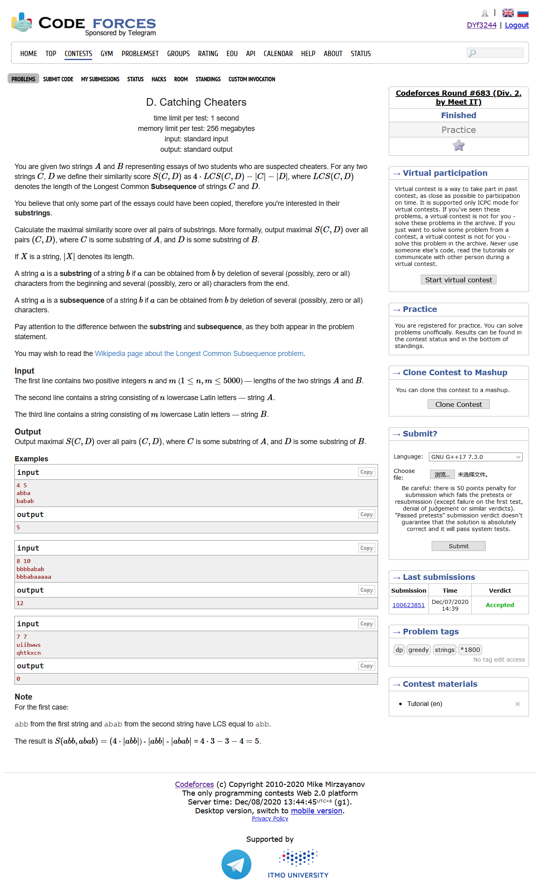
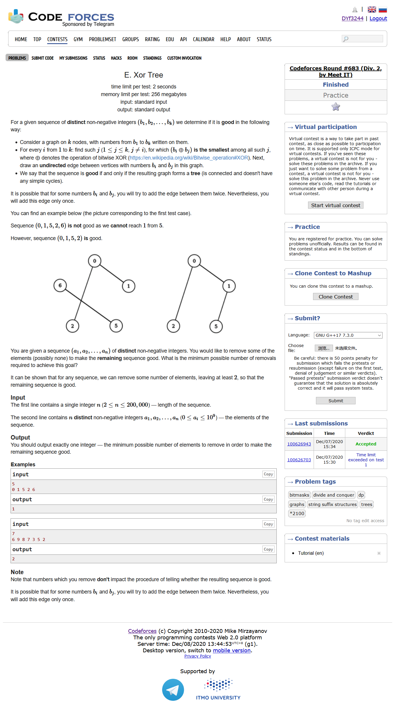
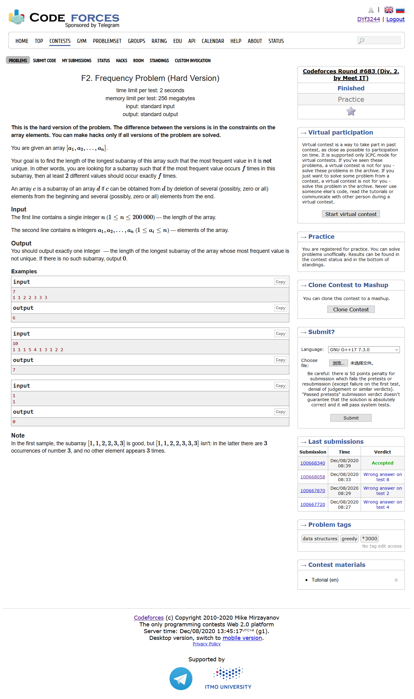

# Codeforces Round #683 (Div. 2, by Meet IT)

https://codeforces.ml/contest/1447

https://codeforces.ml/blog/entry/82067

## [A. Add Candies](https://codeforces.ml/contest/1447/problem/A)



- 题目大意：现在有n个袋子，第i个袋子里面初始有i个糖果。现在你可以对这堆糖果袋子操作m次，每次你都会选择某个袋子拿起来，然后在剩下的袋子当中每个袋子添加j个糖果，j为本次操作的次数，求某个拿袋子的顺序，使得最后所有袋子的糖果数目相等
- 模拟
- 通用的解法就是n个袋子我们最多只需要n-1次操作，即按顺序从第二个袋子到第n个袋子即可

```CPP
#include <bits/stdc++.h>
using namespace std;
#define IOS ios::sync_with_stdio(0);
#define LL long long
#define max_size (int)(2e5 + 10)

int ans[max_size];
int Hash[105];
int main ()
{
	ios::sync_with_stdio(0);
	int T ; cin >> T;
	for ( int cas = 1 ;cas <= T ; cas++ )
	{
		int n ; cin >> n;
		cout << n-1 << endl;
		for ( int i = 2 ; i <= n ; i++ )
			cout << i << " " ;
		cout << endl;	
	}
	
}
```

## [B. Numbers Box](https://codeforces.ml/contest/1447/problem/B)



- 题目大意：给定一个矩阵a，每次你都可以选择相邻的两个元素，对他们都进行取相反数的操作，求最后矩阵所有元素的和的最大值是多少
- 贪心
- 直观的想法是，如果两个元素都是负数，那么我们都对他们进行取相反数的操作，但是实际上，即使负数之间不相邻，我们也可以让他们凑到一块去。因此，如果整个矩阵的负数个数是偶数个或者是矩阵当中有0，那么我们最后的答案就是所有元素的绝对值之和；如果负数的个数是奇数个，那么我们最后的答案就是所有元素的和排除掉绝对值最小的那个元素

```CPP
#include <bits/stdc++.h>
using namespace std;
#define IOS ios::sync_with_stdio(0);
#define LL long long
#define max_size (int)(2e5 + 10)

int ans[105];
int a[15][15];
int main ()
{
	ios::sync_with_stdio(0);
	int T ; cin >> T;
	for ( int cas = 1 ; cas <= T ; cas++ )
	{
		int n , m ;
		cin >> n >> m;
		int res = 0;
		int cou = 0 ;
		vector <int> v;
		for ( int i = 1 ; i <= n ; i++ )
		{
			for ( int j = 1 ; j <= m ; j++ )
			{
				cin >> a[i][j];
				if ( a[i][j] < 0 ) res += abs(a[i][j]) ;
				else res += a[i][j];
				if ( a[i][j] <= 0 ) cou++;
				v.push_back(abs(a[i][j]));
			}
		}
		sort ( v.begin() , v.end() );
		if ( cou % 2 ) res -= 2*v[0];
		ans[cas] = res;
	}
	for ( int i = 1 ; i <= T ; i++ )
		cout << ans[i] << endl;
}
```

## [C. Knapsack](https://codeforces.ml/contest/1447/problem/C)



- 题目大意：给你n件物品，每件物品都有它的重量，现在让你挑出若干件物品，使得他们的总重量之和是$\frac{W+1}{2} \le w \le W$
- 构造
- 我们首先对所有的物品的重量进行排序，并且踢掉重量大于W的那些，我们排除掉两种一定不可能的情况，一种就是所有物品的重量之和小于$\frac{W+1}{2}$，另一种就是最轻的那件物品的重量都大于$W$
- 接下来我们从小到大地挑拣物品，直到物品的总重量落在我们所需要的区间即可。但是有一种情况，有没有可能到了某件物品的时候重量没有到达我们想要的区间，但是把下一件物品加上的时候又会超过我们要的区间呢？当然是有的，但是如果有这件物品，那么它本身的重量一定是在我们要的区间范围内的，我们直接把这件物品带走即可

```CPP
#include <bits/stdc++.h>
using namespace std;
#define IOS ios::sync_with_stdio(0);
#define LL long long
#define max_size (int)(2e5 + 10)


LL w[max_size];
int r[max_size];
bool cmp ( int i , int j ) {
    return w[i] < w[j] ;
}
int main ()
{
    ios::sync_with_stdio(0);
    int T ; cin >> T;
    while (T--)
    {
        LL n , W;
        cin >> n >> W;
        for ( int i = 1 ; i <= n ; i++ ) r[i] = i ;
        for ( int i = 1 ; i <= n ; i++ ) cin >> w[i];
        LL sum = 0 ;
        sort ( r+1 , r+1+n , cmp );
        for ( int i = 1 ; i <= n ; i++ ) 
        {
            int x = r[i];
            if ( w[x] > W ) break;
            sum += w[x];
        }
        if ( w[r[1]] > W || sum < (W+1)/2 )
            cout << "-1" << endl;
        else
        {
            LL res = 0 ; 
            for ( int i = 1 ; i <= n ; i++ )
            {
                int x = r[i];
                res += w[x];
                if ( w[x] >= (W+1)/2 )
                {
                    cout << "1" << endl;
                    cout << x << endl;
                    break;
                }
                else if ( res >= (W+1)/2 && res <= W )
                {
                    cout << i << endl;
                    for ( int j = 1 ; j <= i ; j++ )
                        cout << r[j] << " ";
                    cout << endl;
                    break;
                }
            }
        }
        
    }
}
```

## [D. Catching Cheaters](https://codeforces.ml/contest/1447/problem/D)



- 题目大意：给定A，B两个字符串，取出他们的两个子串C，D，要使得CD的最长子序列的4倍减去CD的长度之和的值最大
- DP
- 换个角度来看也就是求一个AB的最长公共子序列，设$dp[i][j]$为A串前i个字符和B串前j个字符的公共子序列，但是我们的状态转移方程为

$$
dp[i][j] = max ( dp[i][j] , dp[i-1][j-1] + 1 ) if ( A[i] == B[j] )
$$
$$
dp[i][j] = max ( {0 , dp[i-1][j]-1 , dp[i][j-1]-1 } ) if ( A[i] != B[j] )
$$

```CPP
#include <bits/stdc++.h>
using namespace std;
#define IOS ios::sync_with_stdio(0);
#define LL long long
#define max_size (int)(2e5 + 10)

int n , m ;
string A , B ;
int dp[5005][5005];
int main ()
{
    ios::sync_with_stdio(0);
    cin >> n >> m ;
    cin >> A >> B ;
    A = ' ' + A ;
    B = ' ' + B ;
    int res =  0 ;
    for ( int i = 1 ; i <= n ; i++ )
    {
        for ( int j = 1 ; j <= m ; j++ )
        {
            if ( A[i] == B[j] )
            {
                dp[i][j] = max ( dp[i][j] , dp[i-1][j-1] + 2 );
            }
            else
            {
                dp[i][j] = max ( {0 , dp[i-1][j]-1 , dp[i][j-1]-1} );
            }
            res = max ( res , dp[i][j] );   
        }
    }
    cout << res << endl;
}
```

## [E. Xor Tree](https://codeforces.ml/contest/1447/problem/E)



- 题目大意：给定互不相同的几个数a，第i个数会跟第j个数连成一条边，j是所有数字当中能和第i个数异或值最小的数字，求我们最少应该删掉几个数字，使得最后的连边正好可以构成一棵树
- 字典树分治
- 我们可以对每个数字从最高位到最低位进行枚举，构造出一棵01字典树，最后我们要得到的应该是没有多于一个子节点的树，我们可以通过找到树的最大子树来判断最后应该删除多少个数字

```CPP
#include <bits/stdc++.h>
using namespace std;
#define IOS ios::sync_with_stdio(0);
#define LL long long
#define max_size (int)(2e5 + 10)

int n ;
int a[max_size];

int bitree[max_size<<5][2];
int cnt = 1;
void insert ( int x )
{
    int p = 1;
    for ( int i = 30 ; i >= 0 ; i-- )
    {
        int t = ((1<<i)&x) > 0;
        if ( !bitree[p][t] ) bitree[p][t] = ++cnt;
        p = bitree[p][t];
    }
}

int dfs ( int u )
{
    if ( !bitree[u][1] && !bitree[u][0] ) return 1;
    int t0 = 0 , t1 = 0 ;
    if ( bitree[u][0] ) t0 = dfs ( bitree[u][0] );
    if ( bitree[u][1] ) t1 = dfs ( bitree[u][1] );
    if ( t1 && t0 ) return max(t1,t0) + 1;
    else return t1+t0;
}

int main ()
{
    IOS
    cin >> n;
    for ( int i = 1 ; i <= n ; i++ ) cin >> a[i];
    for ( int i = 1 ; i <= n ; i++ ) insert(a[i]);
    cout << n - dfs(1) << endl;
}
```

## [F1. Frequency Problem (Easy Version)](https://codeforces.ml/contest/1447/problem/F1)


- 题目大意：求n个数字某个最大的区间，该区间里面出现次数最多的数字不唯一
- 枚举，前缀和
- 我们可以先看一下整个串当中出现次数最多的数字有多少个，如果这些数字不唯一，那么我们的答案就是整个区间。如果这些数字是唯一的D，我们可以证明，我们要求的最长区间一定会包含这个D
- 对于唯一的情况，我们可以枚举数字i，这个i最后能和D组成最长的子区间，我们构造前缀和sum[j].当遇到D的时候，前缀和+1，遇到数字i的时候，前缀和-1，遇到其他数字的时候我们不做任何变化。对于两个相同的前缀和，我们就可以求算出满足条件的区间，最后取最大的区间长度
- 注意这个题目常数不优化会T

```CPP
#include <bits/stdc++.h>
using namespace std;
#define IOS ios::sync_with_stdio(0);
#define LL long long
#define max_size (int)(2e5 + 10)

int n ; 

int a[max_size];
int Hash[105];
int sum[max_size];
unordered_set<int> st;
int main ()
{
	IOS
	cin >> n;
	for ( int i = 1 ; i <= n ; i++ ) cin >> a[i] , Hash[a[i]]++ , st.insert(a[i]);
	vector<int> v;
	int maxx = 0 ; 
	int D = 0;
	int count = 0;
	for ( auto i : st )
	{
		if ( Hash[i] > maxx )
		{
			count = 1;
			D = i;
			maxx = Hash[i];
		}
		else if ( Hash[i] == maxx )
			count++;
	}
	if ( count > 1 )
		cout << n << endl;
	else
	{
		int res = 0 ;
		for ( auto i : st )
		{
			if ( i == D ) continue;
			unordered_map <int,int> mn;
			mn[0] = 0 ;
			memset ( sum , 0 , (n+5)*sizeof(int) );
			for ( int j = 1 ; j <= n ; j++ )
			{
				if ( a[j] == i ) 
				{
					sum[j] = sum[j-1] - 1;
				}
				else if ( a[j] == D )
				{
					sum[j] = sum[j-1] + 1;
				}
				else
				{
					sum[j] = sum[j-1];
				}
				if ( mn.count(sum[j]) == 0 )
					mn[sum[j]] = j;
				res = max ( res , j - mn[sum[j]] );
			}
			
		}
		cout << res << endl;
	}
	
}
```

## [F2. Frequency Problem (Hard Version)](https://codeforces.ml/contest/1447/problem/F2)



- 题目大意：与F1相同
- 根号分治
- [参考博客](https://blog.csdn.net/qq_30361651/article/details/109763942)

```CPP
#include <bits/stdc++.h>
using namespace std;
#define IOS ios::sync_with_stdio(0);
#define LL long long
#define max_size (int)(2e5 + 10)


int n , D; 
int a[max_size] , Hash[max_size];
int sum[max_size];
int res = 0 ;
int cnt[max_size];
void solve1 ( int x )
{
	unordered_map <int,int> mn;
	mn[0] = 0 ;
	memset ( sum , 0 , (n+5)*sizeof(int) );
	for ( int i = 1 ; i <= n ; i++ )
	{
		sum[i] = sum[i-1];
		if ( a[i] == x )
			sum[i]--;
		else if ( a[i] == D )
			sum[i]++;
		if ( mn.count(sum[i]) == 0 )
			mn[sum[i]] = i;
		res = max ( res , i - mn[sum[i]] );
	}
}
void solve2 ( int x )
{
	memset ( cnt , 0 , (n+5)*sizeof(int) );
	int l = 1 , eq = 0 ;
	cnt[a[l]]++;
	if ( cnt[a[l]] == x ) eq++;
	for ( int i = 2 ; i <= n ; i++ )
	{
		cnt[a[i]]++;
		if ( cnt[a[i]] == x ) eq++;
		else if ( cnt[a[i]] > x ) 
		{
			if ( cnt[a[i]] == x+1 ) eq--;
			while ( cnt[a[i]] > x )
			{
				cnt[a[l]]--;
				if ( cnt[a[l]] == x ) eq++;
				else if ( cnt[a[l]] == x-1 ) eq--;
				l++;
			}
		}
		if ( eq >= 2 ) res = max ( res , i-l+1 );
	}
}
int main ()
{
	IOS
	cin >> n;
	for ( int i = 1 ; i <= n ; i++ ) cin >> a[i] , Hash[a[i]]++;
	int maxx = 0 ; 
	int count = 0 ;
	for ( int i = 1 ; i <= n ; i++ )
	{
		if ( Hash[i] > maxx )
		{
			maxx = Hash[i];
			D = i;
			count = 1;
		}
		else if ( Hash[i] == maxx )
		{
			count++;
		}
	}
	if ( count >= 2 )
		cout << n << endl;
	else
	{
		int lim = sqrt(n);
		for ( int i = 1 ; i <= n ; i++ ) 
			if ( Hash[i] >= lim && i != D )
				solve1(i);
		for ( int i = 1 ; i < lim ; i++ )
			solve2(i);
		cout << res << endl;
	}
	
}
```