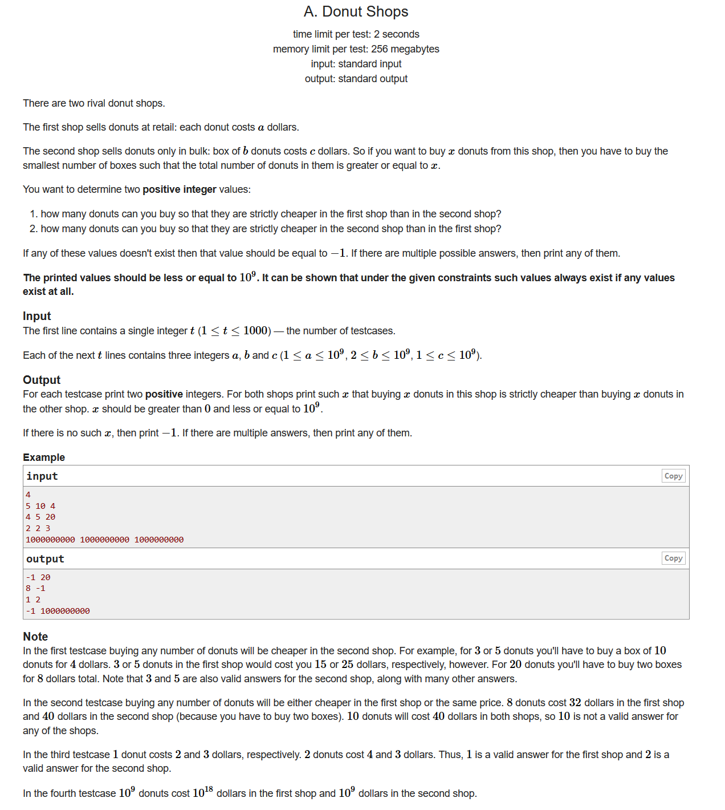
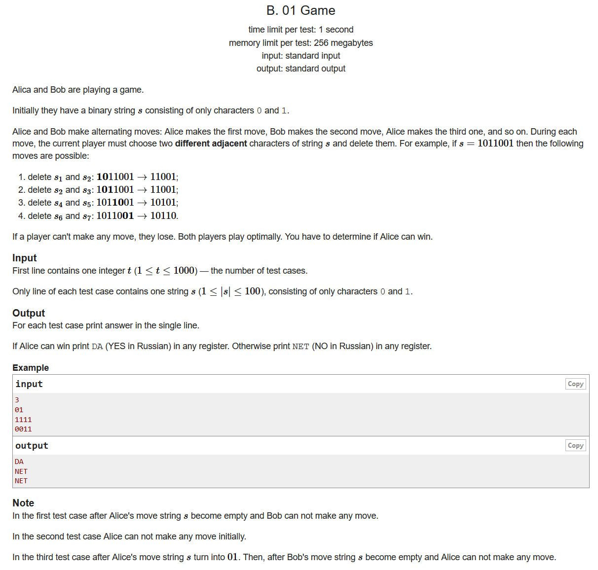
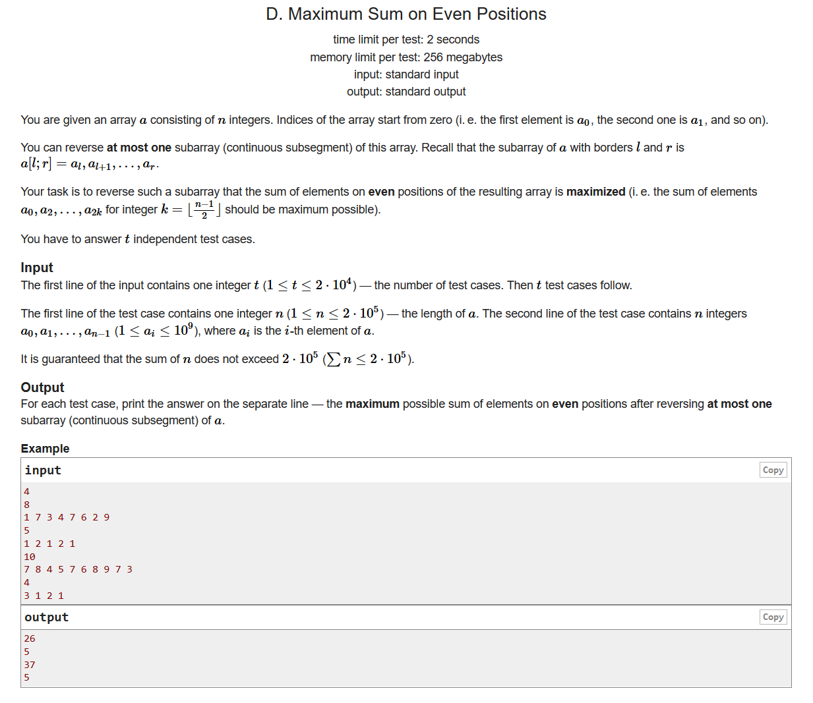
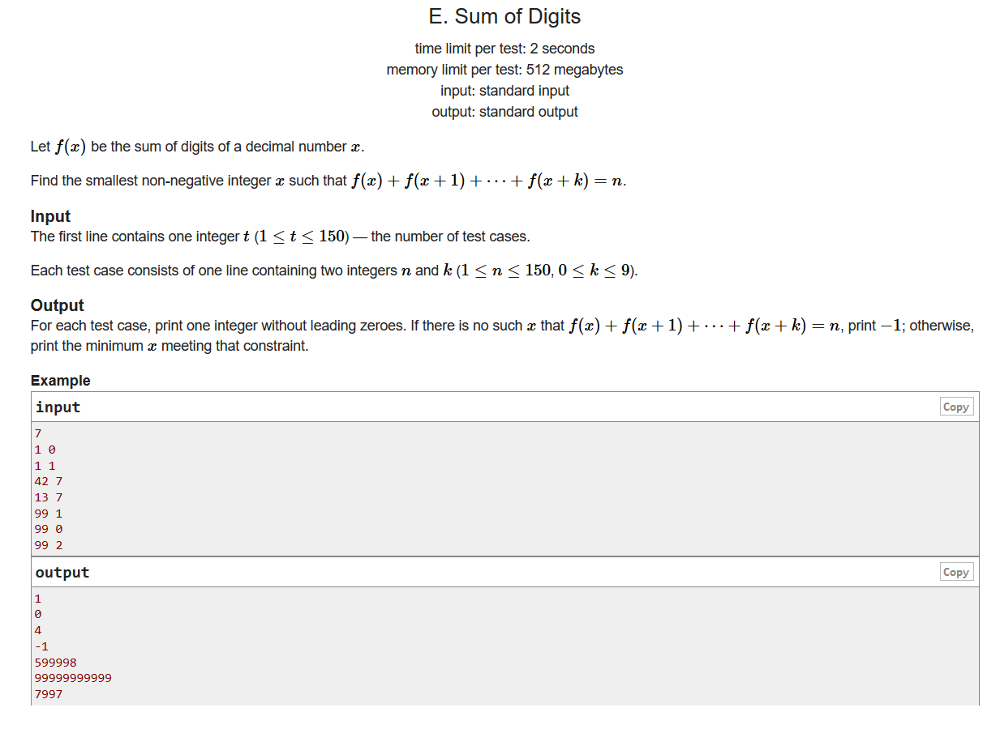
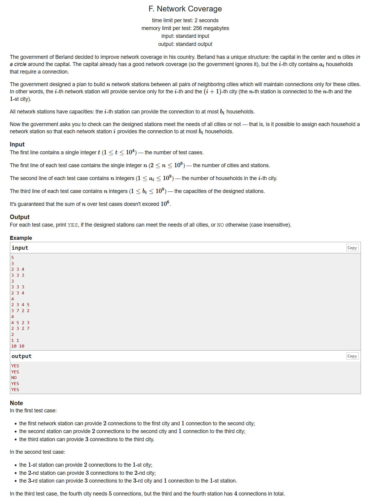
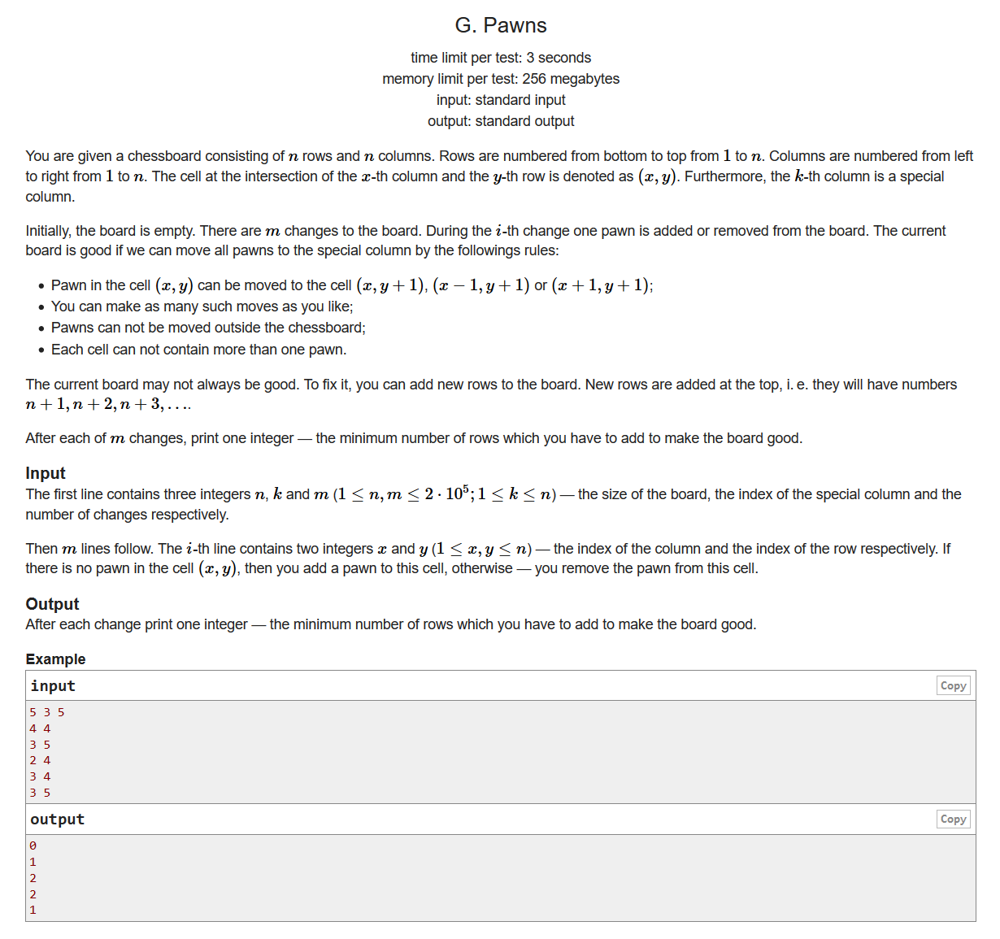

# Educational Codeforces Round 90 (Rated for Div. 2)

[题目链接](https://codeforces.ml/contest/1373)

[官方题解](https://codeforces.ml/blog/entry/79376)

## A. Donut Shops



- 构造题，结论题

```cpp
#include <bits/stdc++.h>
using namespace std;
#define LL long long
#define sigma_size 30
#define max_size (int)(1e3+10)
#define MAX (int)(1e5+7)

pair <int,int> ans[1005];
int main ()
{
	ios::sync_with_stdio(0);
	int T ; cin >> T;
	for ( int cas = 1 ; cas <= T ; cas++ )
	{
		int a , b , c;
		cin >> a >> b >> c;
		if ( a >= c )
		{
			ans[cas].first = -1;
			ans[cas].second = b;
			continue;
		}
		if ( 1ll*a*b <= c )
		{
			ans[cas].first = 1;
			ans[cas].second = -1;
			continue;
		}
		ans[cas].first = 1;
		ans[cas].second = b;
	}
	for ( int i = 1;  i <= T ; i++ )
		cout << ans[i].first << " " << ans[i].second << endl;
}
```

## B. 01 Game



- 结论题
- 如果可以移除的序列奇数个，先手获胜；否则后手获胜

```cpp
#include <bits/stdc++.h>
using namespace std;
#define LL long long
#define sigma_size 30
#define max_size (int)(1e3+10)
#define MAX (int)(1e5+7)

bool ans[1005];
int main ()
{
	ios::sync_with_stdio(0);
	int T ; cin >> T;
	for ( int cas = 1 ; cas <= T ; cas++ )
	{
		string s;
		cin >> s;
		int cur = 0;
		stack <char> v;
		for ( int i = 0 ; i < s.length() ; i++ )
		{
			if ( v.empty() )
				v.push(s[i]);
			else if ( v.top() != s[i] )
				v.pop() , cur++;
			else v.push(s[i]);
		}
		if ( cur % 2 ) ans[cas] = 1;
		else ans[cas] = 0;
	}
	for ( int i = 1 ; i <= T ; i++ )
		if ( ans[i] ) cout << "DA" << endl;
		else cout << "NET" << endl;
}
```

## C. Pluses and Minuses


- 二分
- 我们知道，cur每次进入一次的时候会遇到第一个很小的数使得$cur+a[pos] < 0$ 的时候退出，那首先我们可以很自然的想到，把s的字符转变成+1和-1，计算一下前缀和sum。
- 但是这样的话，我们一个一个查找前缀和sum也是非常耗费时间的，那我们可以求一下sum的最小前缀minx[i]，由于$minx[i] \le minx[i-1]$是单调递减的，因此我们就可以用二分查找，当找到n的时候就结束

```cpp
#include <bits/stdc++.h>
using namespace std;
#define LL long long
#define sigma_size 30
#define max_size (int)(1e6+10)
#define MAX (int)(1e5+7)

LL ans[1005];
int a[max_size];
int sum[max_size];
int minx[max_size];
int main ()
{
	ios::sync_with_stdio(0);
	int T ; cin >> T;
	for ( int cas = 1 ; cas <= T ; cas++ )
	{
		string s;
		cin >> s;
		int n = s.length();
		s = ' ' + s;
		memset ( a , 0 , sizeof(int)*(n+5) );
		memset ( sum , 0 , sizeof(int)*(n+5) );
		memset ( minx , 0x3f3f3f3f , sizeof(int)*(n+5) );
		for ( int i = 1 ; i <= n ; i++ )
		{
			if ( s[i] == '-' ) a[i] = -1;
			else a[i] = 1;
		}
		for ( int i = 1 ; i <= n ; i++ )
			sum[i] = sum[i-1] + a[i];
		for ( int i = 1 ; i <= n ; i++ )
			minx[i] = min ( minx[i-1] , sum[i] );
		int cur = 0;
		LL res = 0;
		while (1)
		{
			int left = 0 , right = n;
			while ( left < right )
			{
				int mid = left + right + 1 >> 1;
				if ( cur + minx[mid] >= 0 )
					left = mid;
				else right = mid-1;
			}
			res += left;
			if ( left == n ) break;
			else cur++ , res++;
		}
		ans[cas] = res;
	}
	for ( int i = 1 ; i <= T ; i++ )
		cout << ans[i] << endl;
}
```

## D. Maximum Sum on Even Positions



- 前缀和，枚举
- 我们要想颠倒之后确实能够改变奇数数列的和，那么我们颠倒的时候就一定是选了一个奇数的位置和一个偶数的位置进行颠倒。那么问题就可以转化为，我们选取若干个奇数的序列和若干个偶数的序列，使得他们的和是最大的
- 我们设$sum[i][0]$表示i位置之前的偶数前缀和

    $sum[i][1]$表示奇数位置的前缀和

    同时，我们需要一个diff[i]来计算当我们旋转[1,i]这个区间的时候，能够获得的收益，i为偶数。我们只要找到某个diff[i],使得$diff[i]-minx[i-2]$最大即可，minx[i]表示i位置之前的最小收益

    同理，我们用相同的方式处理区间[2,i]，i为奇数

```cpp
#include <bits/stdc++.h>
using namespace std;
#define LL long long
#define sigma_size 30
#define max_size (int)(2e5+10)
#define MAX (int)(1e5+7)

LL a[max_size];
LL ans[max_size];
LL sum[max_size][2];
LL minx[max_size];
LL diff[max_size];
LL diff2[max_size];
LL minx2[max_size];
int main ()
{
	ios::sync_with_stdio(0);
	int T ; cin >> T;
	for ( int cas = 1 ; cas <= T ; cas++ )
	{
		int n ; cin >> n;
		for ( int i = 1 ; i <= n ; i++ ) cin >> a[i];
		memset ( minx , 0 , (n+5)*sizeof(LL) );
		memset ( diff , 0 , (n+5)*sizeof(LL) );
		memset ( sum , 0 , (n+5)*3*sizeof(LL) );
		memset ( minx2 , 0 , (n+5)*sizeof(LL) );
		memset ( diff2 , 0 , (n+5)*sizeof(LL) );
		for ( int i = 1 ; i <= n ; i++)
		{
			sum[i][0] = sum[i-1][0];
			sum[i][1] = sum[i-1][1];
			if ( i % 2 ) sum[i][1] += a[i];
			else sum[i][0] += a[i];
			//cout << sum[i][1] << " " << sum[i][0] << endl;
		}
		LL res = sum[n][1];
		//cout << res << endl;
		LL maxx = 0;
		for ( int i = 2 ; i <= n ; i+=2 )
		{
			diff[i] = sum[i][0] - sum[i][1];
			minx[i] = min ( minx[i-2] , diff[i] );
			maxx = max ( maxx , diff[i] - minx[i-2] );
		}
		for ( int i = 3 ; i <= n ; i+=2 )
		{
			diff2[i] = sum[i][0] - sum[i][1] + sum[1][1];
			minx2[i] = min ( minx2[i-2] , diff2[i] );
			maxx = max ( maxx , diff2[i] - minx2[i-2] );
		}
		ans[cas] = res + maxx ;
	}
	for ( int i = 1 ; i <= T ; i++ )
		cout << ans[i] << endl;
}
```

## E. Sum of Digits



```cpp
#include <bits/stdc++.h>
using namespace std;
#define LL long long
#define sigma_size 30
#define max_size (int)(5e5+10)
#define MAX (int)(1e5+7)

LL ans[155];

int main ()
{
    ios::sync_with_stdio(0);
    int T ; cin >> T;
    for ( int cas = 1 ; cas <= T ; cas++ )
    {
        int n , k;
        cin >> n >> k;
        LL res = 2e18;
        bool flag = false;
        for ( int c = 0 ; c <= 9 ; c++ )
        {
            if ( c + k <= 9 )
            {
                int now = n - k*(k+1)/2;
                if ( now % (k+1) ) continue;
                now /= (k+1);
                LL tp = c , b = 1;
                now -= c;
                if ( now < 0 ) continue;
                while ( now > 9 )
                {
                    b *= 10;
                    tp += b*9;
                    now -= 9;
                }
                if ( now ) b *= 10 , tp += b*now ;
                res = min ( res , tp ) ; flag = 1;
                continue;
            }
            for ( int t  = 0 ; t <= 15 ; t++ )
            {
                int now = n + (t+1)*9*(c+k-9) - (1+k)*k/2;
                if ( now % (k+1) ) continue;
                now /= (k+1);
                LL tp = c , b = 1 ; now -= c;
                for ( int j = 1 ; j <= t ; j++ )
                {
                    b *= 10;
                    tp += b*9;
                    now -= 9;
                }
                if ( now  < 0 ) continue;
                if ( now >= 8 ) b *= 10 , tp += b*8 , now -= 8;
                while ( now > 9 )
                {
                    b *= 10;
                    tp += b*9 ;
                    now -= 9;
                }
                if ( now ) b *= 10 , tp += b*now;
                res = min ( res , tp  ) ; flag = 1;
            }
        }
        if ( flag ) ans[cas] = res;
        else ans[cas] = -1;
    }
    for ( int i =1 ; i <= T ; i++ )
        cout << ans[i] << endl;
}
```

## F. Network Coverage



```cpp
#include <bits/stdc++.h>
using namespace std;
#define LL long long
#define ULL unsigned long long
#define sigma_size 30
#define max_size (int)(1e6+10)
#define MAX_SIZE (int)(4e6+7)

int n ;
LL a[max_size] , b[max_size];
bool ans[max_size];
int judge ( int x )
{
	for ( int i = 2 ; i <= n ; i++ )
	{
		int res = b[i-1] - x;
		if ( res + b[i] < a[i] ) return -1;
		x = a[i] > res ? a[i] - res : 0;
	}
	return b[n] - x;
}
int main ()
{
	ios::sync_with_stdio(0);
	int T ; cin >> T;
	for ( int cas = 1 ; cas <=T ; cas++ )
	{
		cin >> n ;
		for ( int i = 1 ; i <= n ; i++ ) cin >> a[i];
		for ( int i = 1 ; i <= n ; i++ ) cin >> b[i];
		int left = 0 , right = min(a[1],b[1]);
		while ( left < right )
		{
			int mid = left + right + 1 >> 1;
			if ( judge(mid) == -1 ) right = mid - 1;
			else left = mid;
		}
		if ( left + judge(left) >= a[1] ) ans[cas] = 1;
		else ans[cas] = 0;
	}
	for ( int i = 1 ; i <= T ; i++ )
		if ( ans[i] ) cout << "YES" << endl;
		else cout << "NO" << endl;
}
```

## G. Pawns



```cpp
#include <bits/stdc++.h>
using namespace std;
#define LL long long
#define sigma_size 30
#define max_size (int)(1e6+10)
#define _DEBUG1 freopen("input.txt", "r", stdin);freopen("output.txt", "w", stdout);
#define _DEBUG2 fclose("input.txt");fclose("output.txt");

int n , m , k;
int t[max_size<<2] , lz[max_size<<2] , cnt[max_size];

void build ( int l , int r , int x )
{
	if ( l == r )
	{
		t[x] = l - 1;
		return ;
	}
	int mid = l + r >> 1;
	build ( l , mid , x<<1 );
	build ( mid+1 , r , x<<1|1 );
	t[x] = max ( t[x<<1] , t[x<<1|1] ) ;
}

void pushdown ( int x )
{
	if ( lz[x] != 0  )
	{
		t[x<<1] += lz[x] , t[x<<1|1] += lz[x];
		lz[x<<1] += lz[x] , lz[x<<1|1] += lz[x];
		lz[x] = 0;
		return ;
	}
}

void update ( int L , int R , int l , int r , int x , int c )
{
	if ( l > R || r < L ) return ;
	if ( l >= L && r <= R )
	{
		t[x] += c , lz[x] += c;
		return ;
	}
	pushdown(x);
	int mid = l + r >> 1;
	update ( L , R , l , mid , x<<1 , c );
	update ( L , R , mid+1 , r , x<<1|1 , c );
	t[x] = max ( t[x<<1] , t[x<<1|1] );
}

int query ( int L , int R , int l , int r , int x )
{
	if ( l > R || r < L ) return 0;
	if ( l >= L && r <= R ) return t[x];
	pushdown(x);
	int mid = l + r >> 1;
	int res = 0;
	res = max ( res , query ( L , R , l , mid , x<<1 ) );
	res = max ( res , query ( L , R , mid+1 , r , x<<1|1 ) );
	t[x] = max ( t[x<<1] , t[x<<1|1] );
	return res;
}

int ans[max_size];

int main ()
{
	ios::sync_with_stdio(0);
	cin >> n >> k >> m;
	build ( 1 , n<<1 , 1 );
	set < pair<int,int> > p;
	set <int> mx;
	for ( int cas = 1 ; cas <= m ; cas++ )
	{
		int x , y;
		cin >> y >> x;
		int pos = x + abs(y-k);
		if ( p.count({x,y}) )
		{
			cnt[pos]--;
			if ( cnt[pos] == 0 ) mx.erase(pos);
			p.erase({x,y});
			update ( 1 , pos , 1 , n<<1 , 1 , -1 );
		}else
		{
			cnt[pos]++;
			mx.insert(pos);
			p.insert({x,y});
			update ( 1 , pos , 1 , n<<1 , 1 , 1);
		}
		if ( mx.empty() ) ans[cas] = 0;
		else ans[cas] = max ( query(1,*mx.rbegin(),1,n<<1,1) - n , 0 );
	}
	for ( int i = 1 ; i <= m ; i++ )
		cout << ans[i] << endl;
}
```

