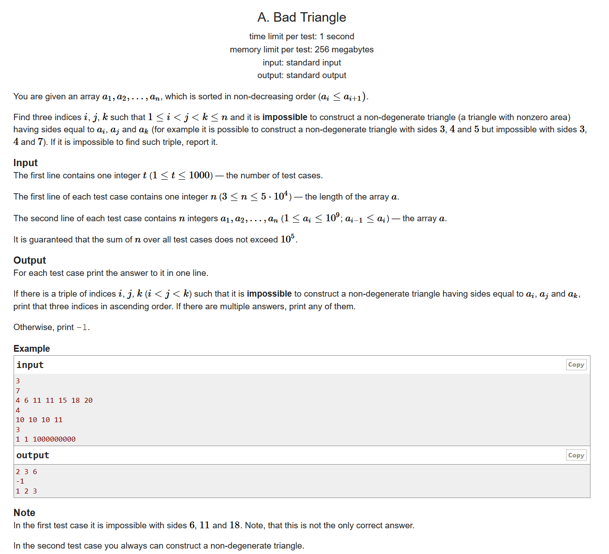
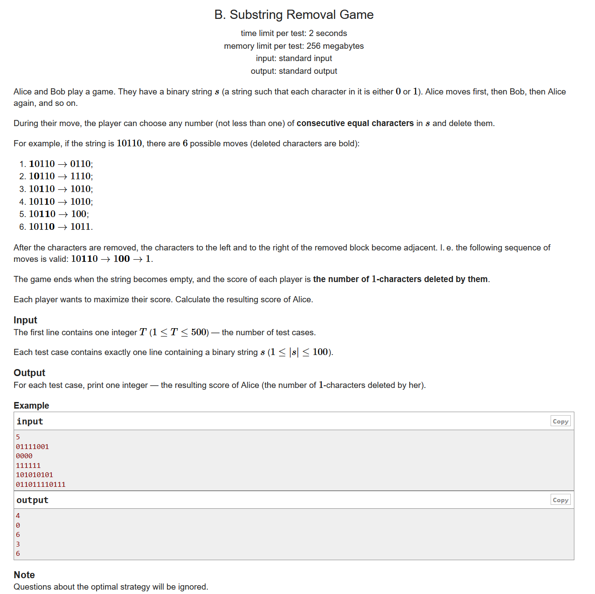
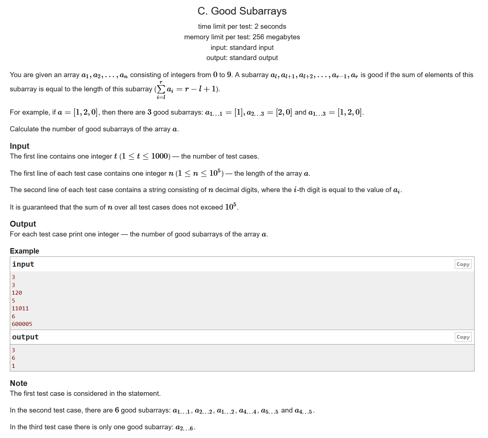

# Educational Codeforces Round 93 (Rated for Div. 2)

- https://codeforces.ml/contest/1398/problems

## A. Bad Triangle



- 排序
- 从小到大排序，看前两个元素和最后一个元素能否构成三角形即可

```cpp
#include <bits/stdc++.h>
using namespace std;
#define LL long long
#define sigma_size 30
#define max_size (int)(5e4+10)
#define MAX (int)(1e5+7)

LL a[max_size];
int main ()
{
	ios::sync_with_stdio(0);
	int T ; cin >> T;
	while ( T-- )
	{
		int n ; cin >> n;
		for ( int i =1  ; i <= n ; i++ ) cin >> a[i];

		if ( a[1] + a[2] <= a[n] )
		{
			cout << "1 2 " << n << endl;
		}
		else cout << "-1" << endl;
	}
}
```


## B. Substring Removal Game



- 签到
- 把含有若干连续的1存放起来，每个元素都存放这个区间有多少个1，最后相隔计算即可

```cpp
#include <bits/stdc++.h>
using namespace std;
#define LL long long
#define sigma_size 30
#define max_size (int)(1e5+10)
#define MAX (int)(1e5+7)

int ans[505];
int main ()
{
	ios::sync_with_stdio(0);
	int T ; cin >> T;
	for ( int cas = 1 ; cas <= T ; cas++ )
	{
		string s;
		cin >> s;
		vector <int> p;
		for ( int i = 0 ; i < s.length() ; i++ )
		{
			if ( s[i] == '0' ) continue;
			int cnt = 0;
			while ( s[i] == '1' )
			{
				cnt++;
				i++;
			}
			p.push_back(cnt);
		}
		sort ( p.begin() , p.end() , greater<int>() );
		int res = 0;
		for ( int i = 0 ; i < p.size() ; i+=2 )
			res += p[i];
		ans[cas] = res;
	}
	for ( int i = 1 ; i <= T ; i++ )
		cout << ans[i] << endl;
}
```

## C. Good Subarrays



- 前缀和
- 我们先对这个数列进行预处理，即每个数字都-1。
- 接着我们计算一下他们的前缀和，那么对于前缀和相等的两个数字sum[i-1]==sum[j]，我们就可以得到[i,j]这个区间和为0，注意sum[0]=0
- 对sum数组统计一下每个相同数字的个数，计算他们的组合数$C_n^2$即可

```cpp
#include <bits/stdc++.h>
using namespace std;
#define LL long long
#define sigma_size 30
#define max_size (int)(1e5+10)
#define MAX (int)(1e5+7)


int a[max_size];
LL C ( int x ) {
	return 1ll*x*(x-1)/2;
}
LL ans[1005];
int main ()
{
	ios::sync_with_stdio(0);
	int T ; cin >> T;
	for ( int cas = 1 ; cas <= T ; cas++ )
	{
		int n ; cin >> n;
		string s;
		cin >> s;
		for ( int i = 1 ; i <= n ; i++ )
		{
			a[i] = (int)(s[i-1]-'0');
			a[i] -= 1;
		}
		for ( int i = 2 ; i <= n ; i++ )
			a[i] = a[i-1] + a[i];
		
		a[0] = 0;
		map <int,int> mp;
		for ( int i = 0 ; i <= n ; i++ )
			mp[a[i]]++;
		LL res = 0;
		for ( auto it = mp.begin() ; it != mp.end() ; it++ )
			res += C ( it->second );
		ans[cas] = res;
	}
	for ( int i = 1 ; i <= T ; i++ )
		cout << ans[i] << endl;
}
```

## D. Colored Rectangles


- dp
- 先对三个数列排个序，由贪心的思想可以知道，我们每次要在这个集合里面挑筷子的时候，一定是取当前最大的
- 用dp[i][j][k]表示当前取了i个R，j个G，k个B，那么我们很容易可以得到状态转移方程：

	$$ 
	dp[i][j][k] = max ( dp[i-1][j-1][k] + r[i]*g[j] , dp[i-1][j][k-1] + r[i]*b[k] , dp[i][j-1][k-1]+g[j]*b[k] ) 
	$$

```cpp
#include <bits/stdc++.h>
using namespace std;
#define LL long long
#define sigma_size 30
#define max_size (int)(1e5+10)
#define MAX (int)(1e5+7)

int R , G , B;
LL r[205] , g[205] , b[205];
LL dp[205][205][205];
int main ()
{
	ios::sync_with_stdio(0);
	cin >> R >> G >> B ;
	for ( int i = 1 ; i <= R ; i++ ) cin >> r[i];
	for ( int i = 1 ; i <= G ; i++ ) cin >> g[i];
	for ( int i = 1 ; i <= B ; i++ ) cin >> b[i];
	sort ( r+1 , r+R+1 , greater<LL>() );
	sort ( g+1 , g+G+1 , greater<LL>() );
	sort ( b+1 , b+B+1 , greater<LL>() );
	LL ans = 0;
	for ( int i = 0 ; i <= R ; i++ )
		for ( int j = 0 ; j <= G ; j++ )
			for ( int k = 0 ; k <= B ; k++ )
			{
				if ( i && j )
					dp[i][j][k] = max ( dp[i][j][k] , dp[i-1][j-1][k]+r[i]*g[j] );
				if ( j && k )
					dp[i][j][k] = max ( dp[i][j][k] , dp[i][j-1][k-1]+g[j]*b[k] );
				if ( i && k )
					dp[i][j][k] = max ( dp[i][j][k] , dp[i-1][j][k-1]+r[i]*b[k] ); 
				ans = max ( ans , dp[i][j][k] );
			}
	cout << ans << endl;
}
```

## E. Two Types of Spells


- 贪心，set
- 我们需要进行倍增的数字就是整个序列当中元素最大的那几个。假设我们现在有k个lighting spells，那么我们就应该倍增当前序列中最大的k个元素；特殊的是，最大的k个元素都是lighting spells，那么我们的总和就应该是k-1个lighting spells和1个最大的fire spells
- 处理的时候我们可以用两个集合来实现，其中一个用来存放当前最大的k个元素，另一个用来存放其他元素，当用来存放最大的k个元素的集合已经大于lighting spells的数目的时候，我们就考虑移出最小的那些元素

```cpp
#include <bits/stdc++.h>
using namespace std;
#define LL long long
#define sigma_size 30
#define max_size (int)(1e6+10)
#define MAX (int)(1e5+7)

int n ;
set <int> sd;
LL sum[2];
set <int> s[2];
int cnt[2];

void update ( int id )
{
    assert(s[id].size() > 0);
    int x = *s[id].rbegin();
    if ( id == 1 ) x = *s[id].begin();
    bool d = sd.count(x);

    sum[id] -= x , sum[!id] += x;
    s[id].erase(x) , s[!id].insert(x);
    cnt[id] -= d , cnt[!id] += d;
}

LL ans[max_size];
int main ()
{
    ios::sync_with_stdio(0);
    cin >> n;
    for ( int i = 1 ; i <= n ; i++ )
    {
        int tp , d;
        cin >> tp >> d;

        if ( d > 0 )
        {
            sum[0] += d;
            s[0].insert(d);
            cnt[0] += tp;
            if ( tp == 1 ) sd.insert(d);
        }
        else
        {
            d = -d;
            int id = 0;
            if ( s[1].count(d) ) id = 1;
            else assert ( s[0].count(d) );

            sum[id] -= d;
            s[id].erase(d);
            cnt[id] -= tp;
            if ( tp == 1 ) {
                assert ( sd.count(d) );
                sd.erase(d);
            }
        }

        int sumdouble = cnt[0] + cnt[1];
        while ( s[1].size() < sumdouble ) update(0);
        while ( s[1].size() > sumdouble ) update(1);
        while ( s[1].size() > 0 && s[0].size() > 0 && *s[0].rbegin() > *s[1].begin() )
        {
            update (0);
            update (1);
        }
        assert ( s[1].size() == sumdouble );

        LL res = sum[0] + sum[1]*2;
        if ( cnt[1] == sumdouble && sumdouble > 0 )
        {
            res -= *s[1].begin();
            if ( s[0].size() > 0 ) res += *s[0].rbegin();
        }
        ans[i] = res;
    }
    for ( int i = 1 ; i <= n ; i++ )
        cout << ans[i] << endl;
}
```
## F. Controversial Rounds


- 前缀和
- 我们用一个数组pre[i][2]用来存放i之前的上一个1或者是0的位置，可以是i.那么对于区间s[l,r]，如果pre[r][1] == pre[l-1][1] 或者 pre[r][0] == pre[l-1][0]我们就可以知道[l,r]之间的元素要么全是1或者'?'，要么全是0或者'?'，这样就是一个满足条件的区间
- 那么对于区间长度为x的时候，我们有区间[l,l+x-1]，这个区间我们可以很容易判断出是否相等。如果相等的话，我们就让l跳到l+x的位置继续寻找；如果不相等，我们就得跳到一个特定的位置继续寻找下去，这个位置我们可以确定p = min ( pre[i][1] , pre[i][0] ) + 1 , l跳到这个位置之后再继续找下去;

```cpp
#include <bits/stdc++.h>
using namespace std;
#define LL long long
#define ULL unsigned long long
#define sigma_size 30
#define max_size (int)(1e6+10)
#define MAX_SIZE (int)(4e6+7)

int pre[max_size][2];
int a[max_size];
char s[max_size];

int main ()
{
	ios::sync_with_stdio(0);
	int n ; cin >> n;
	cin >> s+1;
	for ( int i = 1 ; i <= n ; i++ )
	{
		if ( s[i] != '?' ) a[i] = s[i] - '0';
		else a[i] = 2;
	}
	for ( int i = 1 ; i <= n ; i++ )
	{
		pre[i][1] = pre[i-1][1];
		pre[i][0] = pre[i-1][0];
		if ( a[i] == 2 ) continue;
		pre[i][a[i]] = i;
	}
	for ( int x = 1 ; x <= n ; x++ )
	{
		int l = 1;
		int ans = 0;
		while ( l + x - 1 <= n )
		{
			int r = l+x-1;
			if ( pre[l-1][1] == pre[r][1] || pre[l-1][0] == pre[r][0] )
			{
				ans++;
				l = r+1;
			}
			else l = min ( pre[r][0] , pre[r][1] ) + 1;
		}
		cout << ans << " ";
	}
	cout << endl;
	return 0;
}
```