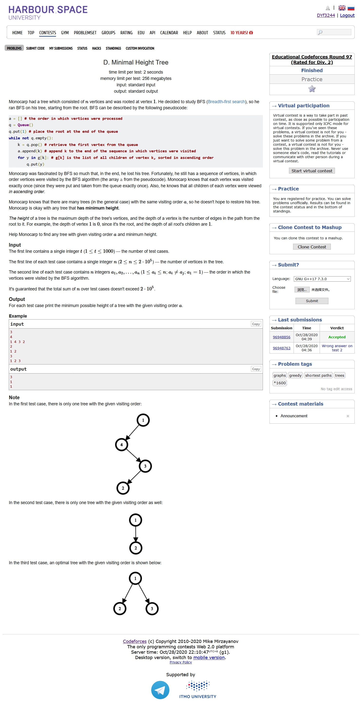
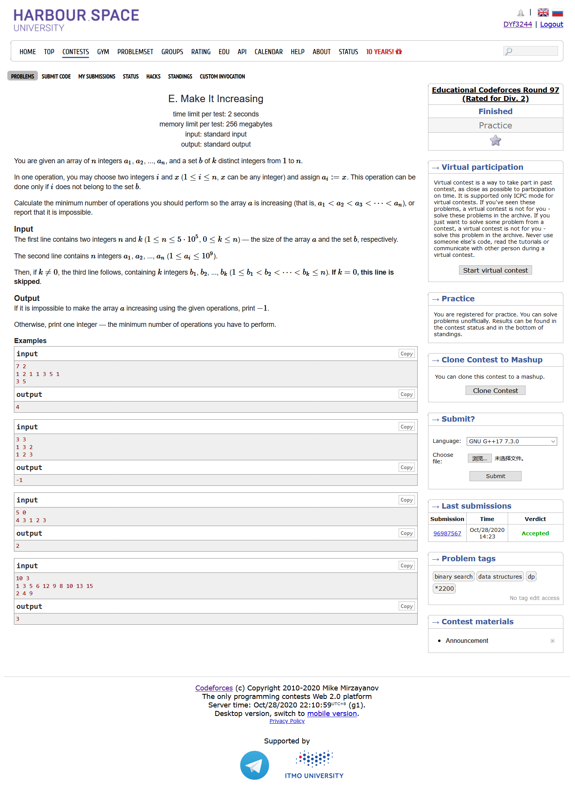

# Educational Codeforces Round 97 (Rated for Div. 2)

[官方题解](https://codeforces.ml/blog/entry/84149)

## [A. Marketing Scheme](https://codeforces.ml/contest/1437/problem/A)


- 思维
- 题目大意：假定某些罐头是按照一包一包卖的，当顾客需要的罐头小于每包所含罐头的一半的时候，顾客会选择一个一个地去买罐头，否则的话顾客会大手一挥买下一包罐头，求问给定顾客的需求区间[l,r]，是否存在某个包装罐头数，使得顾客必须买多于他所需的罐头
- 很明显区间长度太大的时候就一定会存在顾客可以一个一个地买罐头，即当$l*2\le r$的时候是不可能的情况

```cpp
#include <bits/stdc++.h>
using namespace std;
#define LL long long
#define sigma_size 30
#define max_size (int)(1e4+10)
#define MAX (int)(1e5+7)

bool ans[1005];
int main ()
{
	ios::sync_with_stdio(0);
	int T ; cin >> T;
	for ( int cas = 1 ; cas <= T ; cas++ )
	{
		LL l , r;
		cin >> l >> r;
		if ( l * 2 <= r )
			ans[cas] = 0 ;
		else ans[cas] = 1;
	}
	for ( int i = 1 ; i <= T ; i++ )
		if ( ans[i] ) cout << "YES" << endl;
		else cout << "NO" << endl;
}
```

## [B. Reverse Binary Strings](https://codeforces.ml/contest/1437/problem/B)


- 枚举
- 题目大意：给定一个偶数长度的字符串s，求问最少反转多少次子串，才能够使得最后的字符串相邻的两个字符互不相等
- 最后要得到的字符串无非就是010101...和101010...两种情况，我们枚举一下两种情况所需要的操作次数取最小值
- 对于一段连续的偶数的不符合情况的区间，我们只需要反转一次即可；如果是奇数，那一定也存在下一个奇数的连续的不符合情况的区间，这两个区间可以在2次进行反转。那么问题就转化成为：求字符串当中有多少个连续的不符合情况的区间

```cpp
#include <bits/stdc++.h>
using namespace std;
#define LL long long
#define sigma_size 30
#define max_size (int)(1e5+10)
#define MAX (int)(1e5+7)

int ans[1005];
int main ()
{
	ios::sync_with_stdio(0);
	int T ; cin >> T;
	for ( int cas = 1 ; cas <= T ; cas++ )
	{
		int n ; string s;
		cin >> n >> s;
		s = ' ' + s;
		int cnt = 0 ;
		int flag = 0;
		for ( int i = 1 ; i <= n ; i++ )
		{
			if ( s[i] - '0' == flag ) 
			{
				flag = !flag;
				continue;
			} 
			while ( i <= n && s[i] - '0' != flag )
			{
				flag = !flag;
				i++;
			}
			i--;
			cnt++;
		}
		int minx = cnt ; 
		flag = 1;
		cnt = 0 ;
		for ( int i = 1 ; i <= n ; i++ )
		{
			if ( s[i] - '0' == flag ) 
			{
				flag = !flag;
				continue;
			} 
			while ( i <= n  && s[i] - '0' != flag )
			{
				flag = !flag;
				i++;
			}
			i--;
			cnt++;
		}
		minx = min ( minx , cnt );
		ans[cas] = minx;
	}
	for ( int i = 1 ; i <= T ; i++ )
		cout << ans[i] << endl;
}
```

## [C. Chef Monocarp](https://codeforces.ml/contest/1437/problem/C)


- 最小费用最大流
- 题目大意：给定若干道菜，每道菜都有相应的拿出来的时间，每个时间点只能从锅里面拿出一道菜。不在合理的时间拿出这道菜会增加两个时间的距离的不高兴值。请合理分配拿出来的时间点，使得最后的不高兴值最小
- 最后要使得每个菜都能够拿出来，还要使得不高兴值的花费代价最小，我们可以考虑使用最小费用最大流的算法。假设一个超级源点0，它对某个菜的流量为这道菜出现的次数，该费用为0.因为一个菜只能在一个时间节点取出来，所以对于它应该取出来的时间连一条边，流量为1，费用为他们的时间距离。因为每个时间节点只能使用一次，所以最后每个时间节点对超级汇点的流量为1，费用为0。最后跑一个MCMF算法即可

```cpp
#include <bits/stdc++.h>
using namespace std;
#define LL long long
#define sigma_size 30
#define max_size (int)(1e5+10)
#define MAX (int)(1e5+7)

const LL INF = 1ll << 60;
const int inf = 1 << 30;

struct Edge {
    int from , to , cap , flow , cost;
};
struct MCMF {
    int n , m , s , t;
    vector <Edge> edges;
    vector <int> G[max_size];
    int inq[max_size];
    int d[max_size];
    int p[max_size];
    int a[max_size];

    void init ( int n ) {
        this -> n = n;
        for ( int i = 0 ; i <= n ; i++ ) G[i].clear();
        edges.clear();
    }

    void Addedge ( int from , int to , int cap , int cost ) {
        edges.push_back((Edge){from , to , cap , 0 , cost });
        edges.push_back((Edge){to , from , 0 , 0 , -cost });
        m = edges.size();
        G[from].push_back(m-2);
        G[to].push_back(m-1);
    }

    bool BellmanFord ( int s , int t , int &flow , int &cost ) {
        for ( int i = 0 ; i <= n ; i++ ) d[i] = inf;
        memset ( inq , 0 , sizeof(inq) );
        d[s] = 0; inq[s] = 1 ; p[s] = 0 ; a[s] = inf;

        queue <int> Q;
        Q.push(s);
        while (!Q.empty()) {
            int u = Q.front() ; Q.pop();
            inq[u] = 0;
            for ( int i = 0 ; i < G[u].size() ; i++ ) {
                Edge& e = edges[G[u][i]];
                if ( e.cap > e.flow && d[e.to] > d[u] + e.cost ) {
                    d[e.to] = d[u] + e.cost;
                    p[e.to] = G[u][i];
                    a[e.to] = min ( a[u] , e.cap - e.flow );
                    if ( !inq[e.to] ) { Q.push(e.to) ; inq[e.to] = 1 ;}
                }
            }
        }
        if ( d[t] == inf ) return false;
        flow += a[t];
        cost += d[t] * a[t];
        int u = t;
        while ( u != s) {
            edges[p[u]].flow += a[t];
            edges[p[u]^1].flow -= a[t];
            u = edges[p[u]].from;
        }
        return true;
    }

    int Maxcost ( int s , int t ) {
        int flow = 0 , cost = 0;
        while ( BellmanFord( s , t , flow , cost ) );
        return cost;
    }
};


int ans[205];
int a[205];
int main ()
{
    ios::sync_with_stdio(0);
    int T ; cin >> T;
    for ( int cas = 1 ; cas <=T ; cas++ )
    {
        int n ; cin >> n;
        for ( int i = 1 ; i <= n ; i++ ) cin >> a[i];
        sort ( a+1 , a+1+n );
        vector < pair<int,int> > v;
        int cur = 0 ;
        for ( int i = 1 ; i <= n ; i++ )
        {
            if ( a[i] != cur )
            {
                cur = a[i];
                int cnt = 0 ;
                while ( i <= n && a[i] == cur )
                {
                    i++;
                    cnt++;
                }
                i--;
                v.push_back({cur , cnt});
            }
        }
        MCMF res;
        res.init(1000);
        for ( int i = 0 ; i < v.size() ; i++ )
        {    
            res.Addedge(0,v[i].first,v[i].second,0);
            for ( int j = 1 ; j <= 400 ; j++ )
                res.Addedge(v[i].first,j+200,1,abs(v[i].first-j));
        }
        for ( int i = 1 ; i <= 400 ; i++ )
            res.Addedge(i+200,999,1,0);
        ans[cas] = res.Maxcost(0,999);
    }
    for ( int i = 1 ; i <= T ; i++ )
        cout << ans[i] << endl;
}
```

## [D. Minimal Height Tree](https://codeforces.ml/contest/1437/problem/D)



- BFS，模拟，贪心
- 题目大意：给定一棵树的BFS序，求这棵树的最小高度为多少
- BFS的遍历相当于就是层次遍历，我们只需要统计一下上一层的节点个数并且尽可能的让每一层的结点个数最大即可

```cpp
#include <bits/stdc++.h>
using namespace std;
#define LL long long
#define sigma_size 30
#define max_size (int)(2e5+10)
#define MAX (int)(1e5+7)

int ans[1005];
int a[max_size];
int main ()
{
    ios::sync_with_stdio(0);
    int T ; cin >> T;
    for ( int cas = 1 ; cas <= T; cas++ )
    {
        int n ; cin >> n;
        for ( int i = 1 ; i <= n ; i++ ) cin >> a[i];

        int cur_dep = 1;
        int cur_cnt = 1;
        int last_cnt = 0;
        for ( int i = 3 ; i <= n ; i++ )
        {
            if ( a[i] > a[i-1] )
            {
                cur_cnt++;
            }
            else
            {
                if ( last_cnt == 0 )
                {
                    cur_dep++;
                    last_cnt = cur_cnt - 1;
                    cur_cnt = 1;
                }
                else
                {
                    last_cnt--;
                    cur_cnt++;
                }
            }
        }
        ans[cas] = cur_dep;
    }
    for ( int i = 1 ; i <= T ; i++ )
        cout << ans[i] << endl;
}
```

## [E. Make It Increasing](https://codeforces.ml/contest/1437/problem/E)



- LIS
- 题目大意：给定一个数列a以及一个集合b，b当中的元素对应的a下标不能动，其他随便动。求最少次数使得a是一个单调递增的数列。
- 对于不能动的元素，我们得判断一下他们中间是否能够容纳相应多的数字，不然的话就是不可能的情况
- 假设现在不能动的元素为0，那么问题就会等价为求最长上升子序列，答案就是总数减去最长上升子序列
- 假设现在不能动的元素不为0，对于每一段我们都可以看成是求最长上升子序列，首尾元素就是对应的不能动的元素，最后把这些数字加起来即可

```cpp
#include <bits/stdc++.h>
using namespace std;
#define LL long long
#define sigma_size 30
#define max_size (int)(5e5 + 10)
#define MAX (int)(1e5+7)

const int inf = INT_MAX;
int n , k;
int a[max_size];
int b[max_size];
int dp[max_size];
int g[max_size];
int dp_solve( int l , int r ) {
    int len = 1;
    g[len] = a[l];
    for ( int i = l+1 ; i <= r ; i++ )
    {
        if ( a[i] >= g[len] )
            g[++len] = a[i];
        else
        {
            int j = upper_bound(g+1,g+1+len,a[i])-g;
            if ( j != 1 )
                g[j] = a[i];
        }
    }
    int pos = upper_bound(g+1,g+1+len,a[r])-g-1;
    return r-l+1-pos;
}

int main ()
{
    ios::sync_with_stdio(0);
    cin >> n >> k;
    for ( int i = 1 ; i <= n ; i++ ) cin >> a[i] , a[i]-=i;
    for ( int i = 1 ; i <= k ; i++ ) cin >> b[i];
    a[0] = -inf;
    a[n+1] = inf;
    b[k+1] = n+1;
    bool flag = 1;
    for ( int i = 2 ; i <= k ; i++ )
    {
        if ( a[b[i]] - a[b[i-1]] < 0 )
        {
            flag = 0;
            break;
        }
    }

    if ( !flag )
        cout << "-1" << endl;
    else
    {
        int res = 0 ;
        for ( int i = 1 ; i <= k+1 ; i++ )
            res += dp_solve(b[i-1],b[i]);
        cout << res << endl;
    }
}
```

## [F. Emotional Fishermen](https://codeforces.ml/contest/1437/problem/F)


- dp
- 题目大意：n个渔夫掉了n条鱼，每条鱼有不同的重量。现在每个渔夫会按照一定的顺序炫耀他们所吊的鱼，如果某个渔夫吊的鱼的重量大于等于当前最大的鱼的重量的2倍，那么这个渔夫会很开心；如果这个渔夫吊的鱼的2倍小于等于当前最大的鱼的重量，那么这个渔夫会很难过。求有多少种排列方式，使得每个渔夫要么开心要么难过
- 我们首先对他们所吊的鱼进行排序
- 假设我们对于第i个渔夫，考虑下一个渔夫的情况。如果下一个渔夫很开心，那么下一个渔夫的鱼至少是$2a_i$，如果下一个渔夫不开心，那么下一个渔夫的鱼最多时$\frac{a_i}{2}$
- 先考虑下一个渔夫是不开心的情况，如果我们已经知道了有多少个渔夫已经按顺序排好了，那么我们就可以知道这些渔夫其实都是不开心的。假设我们已经放好了j个渔夫，并且最后一个开心的渔夫就是第i个，并且我们想要再添加一个伤心的渔夫，这样的方法数就是$cntless[i]-j+1$，cntless[i]就是2倍还小于第i个渔夫的个数
- 现在如果我们能够解决下一个渔夫是开心的情况，那么我们就可以用动态规划的思想来解答。设dp[i][j]表示按顺序选择前j个渔夫以至于第i个渔夫是最后一个开心的渔夫的方法。那么下一个渔夫是伤心的情况就转变成为了dp[i][j+1]。即$dp[i][j] = dp[i][j-1] * (cntless[i]-j+2)$
- 如果下一个渔夫是开心的渔夫呢？我们的dp方程就转变为dp[k][j+1]

```cpp
#include <bits/stdc++.h>
using namespace std;
#define LL long long
#define ULL unsigned long long
#define sigma_size 30
#define max_size (int)(2e5+10)
#define MAX_SIZE (int)(4e6+7)


const LL mod = 998244353;
int n;
LL a[5005];
LL dp[5005][5005];
LL pdp[5005][5005];
int cntless[5005];
int lastless[5005];
int main ()
{
	ios::sync_with_stdio(0);
	cin >> n;
	for ( int i = 1 ; i <= n ; i++ ) cin >> a[i];
	sort ( a+1 , a+1+n ) ;
	for ( int i = 1 ; i <= n ; i++ )
	{
		int cnt = 0 ; 
		for ( int j = 1 ; j <= i ; j++ )
			if ( 2*a[j] <= a[i] )
			{	
				cnt++;
				lastless[i] = j ;
			}
			else break;
		cntless[i] = cnt;
	}

	for ( int i = 1 ; i <= n ; i++ )
	{
		dp[i][1] = 1;
		pdp[i+1][1] = ( dp[i][1] + pdp[i][1] ) % mod;
	}

	for ( int j = 2 ; j <= n ; j++ )
	{
		for ( int i = 1 ; i <= n ; i++ )
		{
			if ( cntless[i] + 1 >= j )
				dp[i][j] = ( dp[i][j-1]*((cntless[i]+2-j+mod)%mod)%mod + pdp[lastless[i]+1][j-1] ) % mod;
			else 
				dp[i][j] = 0 ;
			pdp[i+1][j] = ( pdp[i][j] + dp[i][j] ) % mod;
		}
	}
	cout << dp[n][n] << endl;
}
```

## [G. Death DBMS](https://codeforces.ml/contest/1437/problem/G)


- AC自动机

```cpp
#include <bits/stdc++.h>
using namespace std;
#define LL long long
#define sigma_size 30
#define max_size (int)(1e6+10)
#define _DEBUG1 freopen("input.txt", "r", stdin);freopen("output.txt", "w", stdout);
#define _DEBUG2 fclose("input.txt");fclose("output.txt");

struct Aho_corasick {
	struct node {
		map <int,int> nxt , go;
		int p , pch;
		int suf , ssuf;
		multiset<int> vals;
		bool term;

		node() {
			nxt.clear();
			go.clear();
			suf = ssuf = -1;
			term = false;
			vals.clear();
			p = -1 , pch = -1;
		}
	};

	vector<node> nodes;
	Aho_corasick() {
		nodes = vector<node>(1,node());
	}

	int add ( const string& s ) {
		int v = 0 ;
		for ( int i = 0 ; i < s.size() ; i++ ) {
			int c = s[i] - 'a';
			if ( !nodes[v].nxt.count(c) ) {
				nodes.push_back(node());
				nodes[v].nxt[c] = int(nodes.size()) - 1;
				nodes.back().p = v;
				nodes.back().pch = c;
			}
			v = nodes[v].nxt[c];
		}
		nodes[v].term = true;
		nodes[v].vals.insert(0);
		return v;
	}
	
	int feed ( const string& s ) {
		int v = 0 ;
		int ans = -1;
		for ( int i = 0 ; i < s.size() ; i++ ) {
			int c = s[i] - 'a';
			v = go(v,c);
			int u = v;
			while ( u != 0 )
			{
				if ( !nodes[u].vals.empty() )
					ans = max ( ans , *nodes[u].vals.rbegin() );
				u = ssuf(u);
			}
		}
		return ans;
	}

	int go ( int v , int c ) {
		if ( nodes[v].go.count(c) )
			return nodes[v].go[c];
		if ( nodes[v].nxt.count(c) )
			return nodes[v].go[c] = nodes[v].nxt[c];
		if ( v == 0 )
			return nodes[v].go[c] = 0;
		return nodes[v].go[c] = go(suf(v),c);
	}

	int suf(int v) {
		if ( nodes[v].suf != -1 )
			return nodes[v].suf;
		if ( v == 0 || nodes[v].p == 0 )
			return nodes[v].suf = 0;
		return nodes[v].suf = go(suf(nodes[v].p) , nodes[v].pch);
	}

	int ssuf(int v) {
		if ( nodes[v].ssuf != -1 )
			return nodes[v].ssuf;
		if ( v == 0 || nodes[v].p == 0 )
			return nodes[v].ssuf = 0 ;
		int s = suf(v);
		if ( nodes[s].term )
			return nodes[v].ssuf = s;
		return nodes[v].ssuf = ssuf(s);
	}
};

Aho_corasick ac;
vector <int> pos;
vector <int> val;

vector <int> ans;
int main () 
{
	ios::sync_with_stdio(0);
	int n , m ;
	cin >> n >> m;
	pos.resize(n);
	val.resize(n,0);

	vector <int> tp2;
	ac = Aho_corasick();

	for ( int i = 0 ; i < n ; i++ )
	{
		string s ; cin >> s;
		pos[i] = ac.add(s);
	}

	for ( int i = 1 ; i <= m ; i++ )
	{
		int t ; cin >> t;
		if ( t == 1 ) {
			int j , x;
			cin >> j >> x;
			--j;
			ac.nodes[pos[j]].vals.erase(ac.nodes[pos[j]].vals.find(val[j]));
			val[j] = x;
			ac.nodes[pos[j]].vals.insert(val[j]);
		}
		else
		{
			string q;
			cin >> q;
			ans.push_back(ac.feed(q));
		}
	}
	for ( int i = 0 ; i < ans.size() ; i++ )
		cout << ans[i] << endl;
}
```
